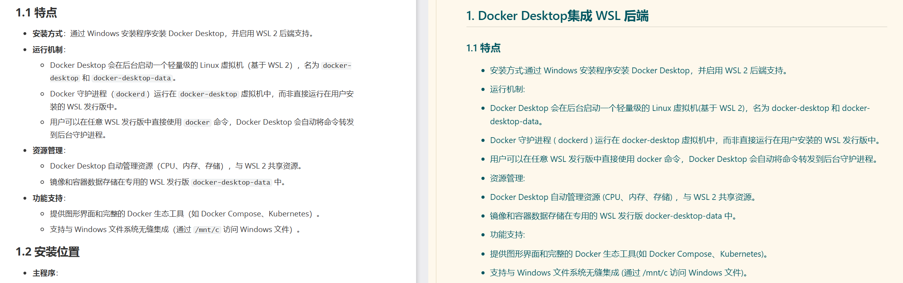

# PDF Parser Compare

用于测试和对比各类 PDF 转 Markdown 工具的效果。

## 测试集

本测试集包含四个难度层级的 PDF 文件，用于评估解析工具在不同场景下的表现。

| 级别 | 文件名 | 难度 | 描述 |
|------|--------|------|------|
| Level 1 | `level-1-markdown.pdf` | 简单 | 由 Markdown 文档转换生成的 PDF |
| Level 2 | `level-2-paper.pdf` | 中等 | 从 arXiv 下载的学术论文 PDF |
| Level 3 | `level-3-markdown-picture.pdf` | 困难 | 与 Level 1 内容相同，但每页为截图形式 |
| Level 4 | `level-4-paper-picture.pdf` | 最困难 | 与 Level 2 内容相同，但每页为截图形式 |

### 难度说明

**Level 1 - Markdown 生成的 PDF**

- 来源：Markdown 文档导出
- 特点：文本层清晰、格式规范、无复杂排版
- 测试重点：基础文本提取、格式还原

**Level 2 - arXiv 论文**

- 来源：arXiv 学术论文
- 特点：包含数学公式、图表、引用、多栏布局
- 测试重点：复杂排版处理、公式识别、表格提取

**Level 3 - Markdown 截图版**

- 内容：与 Level 1 相同
- 形式：每页转换为图片后拼接
- 特点：无文本层，需依赖 OCR
- 测试重点：OCR 准确性、格式还原（有参照对比）

**Level 4 - 论文截图版**

- 内容：与 Level 2 相同
- 形式：每页转换为图片后拼接
- 特点：无文本层、内容复杂、需 OCR
- 测试重点：复杂内容的 OCR 能力、公式图表识别

### 目录结构

```
test-pdfs/
├── level-1-markdown.pdf           # 简单
├── level-2-paper.pdf              # 中等
├── level-3-markdown-picture.pdf   # 困难
└── level-4-paper-picture.pdf      # 最困难
```

### 评估维度

- 文本提取准确率
- 格式还原程度
- 表格识别效果
- 数学公式处理
- OCR 质量（针对图片型 PDF）
- 处理速度

## 测试结果

各工具的转换结果存放在 `results/` 目录下。

### 目录结构

```
results/
└── {工具名称}/
    └── {测试级别}/
        ├── {pdf文件名}.md    # 转换后的 Markdown 文件
        └── images/           # 提取的图片资源
```

### 已测试工具

| 工具 | 说明 |
|------|------|
| doc2x | 网页版在线转换工具 |

### doc2x 测试评价

| 级别 | 文本提取 | 格式还原 | 公式处理 | 图片处理 | 总体评价 |
|------|----------|----------|----------|----------|----------|
| Level 1 | ✓ 正确 | 部分问题 | N/A | ✓ 很好 | 文字处理正确，但丢失粗体，嵌套无序列表识别有问题 |
| Level 2 | ✓ 正确 | ✓ 正确 | ✓ 全部正确 | ✓ 很好 | 少量段落排版会错位；另外 PDF 本身的图片排版就比较难以理解，但是对图片的位置处理是正确的 |
| Level 3 | ✓ 正确 | 部分问题 | N/A | ✓ 很好 | 与 Level 1 结果一致，OCR 效果良好 |
| Level 4 | ✓ 正确 | ✓ 正确 | ✓ 全部正确 | ✓ 很好 | 与 Level 2 结果一致，OCR 复杂内容能力强 |

**Level 1 问题示例：嵌套列表识别错误**

