# Graph-based Semantic Calibration Network for Unaligned UAV RGBT Image Semantic Segmentation and A Large-scale Benchmark

Fangqiang Fan, Zhicheng Zhao*, Xiaoliang Ma, Chenglong Li, and Jin Tang

Abstract-Fine-grained RGBT image semantic segmentation is crucial for all-weather unmanned aerial vehicle (UAV) scene understanding. However, UAV RGBT semantic segmentation faces two coupled challenges: cross-modal spatial misalignment caused by sensor parallax and platform vibration, and severe semantic confusion among fine-grained ground objects under top-down aerial views. To address these issues, we propose a Graph-based Semantic Calibration Network (GSCNet) for unaligned UAV RGBT image semantic segmentation. Specifically, we design a Feature Decoupling and Alignment Module (FDAM) that decouples each modality into shared structural and private perceptual components and performs deformable alignment in the shared subspace, enabling robust spatial correction with reduced modality appearance interference. Moreover, we propose a Semantic Graph Calibration Module (SGCM) that explicitly encodes the hierarchical taxonomy and co-occurrence regularities among ground-object categories in UAV scenes into a structured category graph, and incorporates these priors into graph-attention reasoning to calibrate predictions of visually similar and rare categories. In addition, we construct the Unaligned RGB-Thermal Fine-grained (URTF) benchmark, to the best of our knowledge, the largest and most fine-grained benchmark for unaligned UAV RGBT image semantic segmentation, containing over 25,000 image pairs across 61 categories with realistic cross-modal misalignment. Extensive experiments on URTF demonstrate that GSCNet significantly outperforms state-of-the-art methods, with notable gains on fine-grained categories. The dataset is available at https://github.com/mmic-lcl/Datasets-and-benchmark-code.

Index Terms-RGBT semantic segmentation, fine-grained semantic segmentation, feature decoupling, semantic graph calibration, unmanned aerial vehicle.

## I. INTRODUCTION

UNMANNED aerial vehicles (UAVs) are widely used for all-weather scene understanding in applications such as urban planning, precision agriculture, and traffic monitoring [1], [2]. Semantic segmentation is a core capability in these applications. RGB images provide rich texture cues but degrade under low illumination and adverse weather, whereas thermal infrared images remain informative under these conditions but provide coarser structural details due to their lower spatial resolution [3], [4]. Given these complementary strengths, fusing the two modalities is a natural choice for robust UAV scene understanding [5], [6]. However, on real dual-sensor UAV platforms, RGB and thermal images are rarely pixel-aligned because sensor parallax, platform vibration, and view-dependent distortions introduce spatially varying offsets. Unaligned UAV RGBT image semantic segmentation aims to predict fine-grained semantic masks from spatially misaligned RGB-T image pairs under realistic UAV sensing conditions.

Cross-modal spatial misalignment is difficult to handle in this setting because the offsets are spatially varying and often object-dependent, so no single global transformation can remove them. As Fig. 1 shows, such boundary discrepancies occur across diverse object categories in UAV scenes. When methods such as CMX [7] fuse these misaligned features under an implicit alignment assumption, they mix responses from semantically inconsistent locations, producing ghosting artifacts, blurred boundaries, and missed small targets [8].

Beyond spatial misalignment, severe semantic confusion among fine-grained ground objects poses another major challenge. Under top-down aerial views, many categories share similar visual appearance. Poles, streetlights, and traffic lights, for instance, occupy few pixels and look alike in both RGB and thermal images. The pixel distribution is also long-tailed, leaving rare classes with too few samples to learn stable boundaries. Most existing methods classify pixels in a flat label space and ignore hierarchical or co-occurrence relations among related categories. As Fig. 2 shows, these factors make categories such as pole, streetlight, and traffic light hard to tell apart, with tail classes suffering most from limited training pixels.

These two problems interact: misalignment corrupts the visual evidence that fine-grained recognition depends on, which in turn amplifies confusion among categories that already look alike. We propose GSCNet, a Graph-based Semantic Calibration Network that chains spatial alignment with semantic calibration. Estimating offsets directly in the raw feature space is unreliable because RGB and thermal features differ in appearance and contrast. Our Feature Decoupling and Alignment Module (FDAM) therefore first decouples each modality into shared structural and private perceptual components and then estimates deformable offsets in the shared subspace where the modality gap is reduced, deriving geometric corrections from structurally consistent representations without discarding modality-specific cues. Pixel-level classification alone cannot separate categories that overlap in local appearance, nor can it learn rare ones well without inter-class structure. Our Semantic Graph Calibration Module (SGCM) encodes hierarchical taxonomy and co-occurrence regularities among ground-object categories into a structured category graph and uses graph-attention reasoning so that visually similar and rare categories can borrow discriminative context from semantically related nodes.

---

* Corresponding author: Zhicheng Zhao.

This work was supported in part by the National Natural Science Foundation of China (No. 62306005, 62006002, 62076003, 62376005 and 62576006), and in part by the Natural Science Foundation of Anhui Higher Education Institution (No. 2022AH040014).

F. Fan, Z. Zhao, and C. Li are with Key Laboratory of Intelligent Computing & Signal Processing (Anhui University), Ministry of Education, Anhui Provincial Key Laboratory of Multimodal Cognitive Computation, School of Artificial Intelligence, Anhui University, Hefei 230601, China. (Email: fanadmin@163.com, zhaozhicheng@ahu.edu.cn, lcl1314@foxmail.com).

X. Ma is with the School of Computer Science and Technology, Anhui University, Hefei 230601, China, and also with GEOVIS Earth Technology Co., Ltd., Hefei 230088, China.

J. Tang is with the Anhui Provincial Key Laboratory of Multimodal Cognitive Computation, School of Computer Science and Technology, Anhui University, Hefei 230601, China. (Email: tangjin@ahu.edu.cn).

---

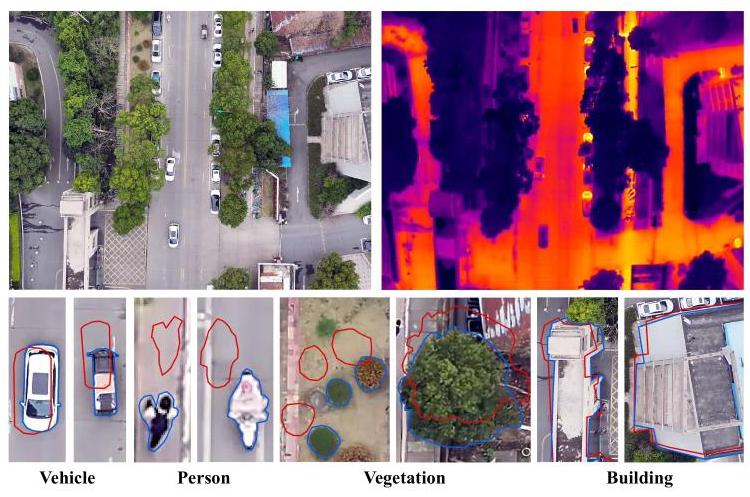

Fig. 1. Cross-modal boundary misalignment in RGB-T UAV imaging. The top row shows an RGB image and its thermal counterpart. In the bottom row, blue contours denote object boundaries in the RGB modality and red contours denote the corresponding boundaries in the thermal modality. Representative examples from vehicles, persons, vegetation, and buildings show that cross-modal spatial offsets are widespread in UAV scenes.

We also construct a large-scale benchmark named URTF (Unaligned RGB-Thermal Fine-grained). Ground-level RGB-T datasets such as MFNet [5], PST900 [6], FMB [9], and MVSeg [10] assume strict pixel-wise registration and provide only coarse category definitions, while UAV-specific datasets such as CART [11], MVUAV [12], and Kust4K [13] still offer limited category granularity or rely on pixel-level alignment. URTF is, to the best of our knowledge, the largest and most fine-grained benchmark for this setting, containing over 25,000 image pairs with 61 semantic categories and realistic cross-modal misalignment under diverse illumination and weather conditions.

The primary contributions of this work are summarized as follows:

- We construct URTF, to the best of our knowledge the largest and most fine-grained benchmark for unaligned UAV RGBT image semantic segmentation, containing over 25,000 image pairs across 61 semantic categories with realistic cross-modal misalignment under diverse illumination and weather conditions.

- We propose GSCNet, a unified spatial-semantic framework for robust fine-grained unaligned UAV RGBT image semantic segmentation, which jointly addresses cross-modal spatial misalignment and fine-grained semantic confusion.

- We propose the Feature Decoupling and Alignment Module (FDAM), which decouples RGB-T features into shared structural and private perceptual components for illumination-aware deformable alignment. In addition, we introduce the Semantic Graph Calibration Module (SGCM), which explicitly encodes hierarchical taxonomy and co-occurrence regularities into a structured category graph and calibrates predictions via graph-attention reasoning.

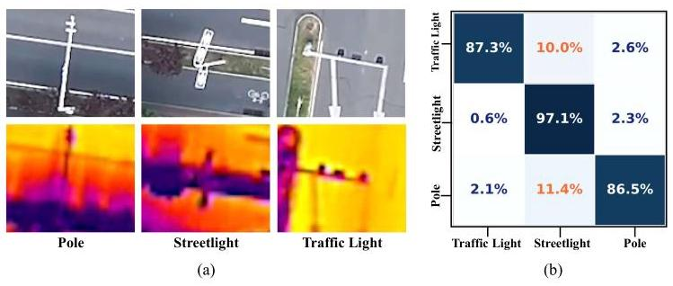

Fig. 2. Fine-grained semantic confusion in UAV aerial scenes. (a) Pole, streetlight, and traffic light occupy only a small number of pixels in both RGB and thermal images and exhibit highly similar appearance from the UAV viewpoint, making them difficult to distinguish. (b) Confusion matrix of these three categories produced by AMDANet, where traffic light and pole are frequently misclassified as streetlight.

- Extensive quantitative and qualitative experiments on URTF demonstrate that GSCNet significantly outperforms existing state-of-the-art RGBT semantic segmentation methods, with notable gains on fine-grained categories under challenging UAV sensing conditions.

## II. RELATED WORK

## A. RGBT Semantic Segmentation

Early multimodal segmentation methods adopt dual-stream CNNs with element-wise fusion. FuseNet [14], originally designed for RGB-D, establishes the element-wise summation paradigm later widely adopted in RGBT segmentation. MFNet [5] introduces a lightweight mini-inception encoder for real-time RGBT parsing, and RTFNet [15] progressively folds thermal features into the RGB decoder. These encoder-fusion designs establish the basic dual-stream paradigm but rely on hand-crafted aggregation rules that cannot selectively weight informative regions. Subsequent work introduces attention mechanisms to modulate cross-modal contributions. FEANet [16] applies a feature-enhanced attention module to exploit fine spatial details, EGFNet [17] adds edge-guided attention for boundary refinement, and GMNet [18] explores channel-level and spatial-level gating to suppress noisy modality responses. More recently, Transformer-based architectures further extend the fusion receptive field: CMX [7] performs cross-attention between RGB and auxiliary tokens, achieving state-of-the-art results on multiple benchmarks. Alongside architectural progress, benchmarks have expanded from the 9- class MFNet dataset [5] to 36-category UAV benchmarks [12], and UAV-specific datasets such as CART [11] and Kust4K [13] have also emerged. Despite this progress, existing RGBT segmentation methods generally assume ideal pixel-level registration, and no RGB-T benchmark simultaneously provides fine-grained annotation granularity, large-scale coverage, and realistic cross-modal misalignment.

## B. Fine-Grained Semantic Segmentation

Semantic segmentation has advanced from FCN-based encoders [19], [20] toward fine-grained recognition, yet global context mechanisms such as dilated convolutions [21] and ASPP [22] alone cannot resolve inter-class confusion where category boundaries correlate with semantic attributes rather than visual gradients. Fine-grained segmentation faces two coupled difficulties: inter-class confusion among visually similar subcategories and long-tailed recognition where rare categories are under-optimized. Graph-based reasoning has been introduced to capture inter-class relations beyond local receptive fields. GloRe [23] projects pixel features onto a set of latent nodes and performs relational reasoning in the graph domain, while DGMN [24] dynamically generates graph structures conditioned on each input image. In remote sensing, SAGRNet [25] builds object-level graphs with co-occurrence statistics to improve vegetation classification. Other methods inject external priors such as hierarchical taxonomy [26] or label co-occurrence [27] into the graph topology. However, purely data-driven graphs lack interpretable structure, whereas static prior graphs cannot adapt to scene-specific category distributions. Our SGCM combines both: it initializes the adjacency from hierarchical and co-occurrence priors and augments it with a learnable residual that adapts to data-driven patterns during training.

## C. Unaligned Multimodal Fusion

Estimating spatial correspondence between heterogeneous sensor modalities is a prerequisite for coherent feature fusion. Classical global transforms [28] cannot capture local, depth-dependent parallax on UAV platforms, while dense per-pixel methods (STN [29], optical flow [30], [31]) suffer from the modality-gap dilemma in which appearance discrepancy is conflated with genuine offsets; deformable convolution [32] handles intra-modal irregularities but does not address unreliable cross-modal offset estimation. Recent work couples alignment with downstream tasks. OAFA [8] projects RGB-T features into a common subspace for deformable offset estimation, and RegSeg [33] jointly optimizes registration and segmentation through a shared encoder. These methods improve alignment but neither separates modality-shared structure from modality-specific appearance, leaving alignment exposed to residual cross-modal interference. Zhou et al. [34] construct synthetically deformed pairs from the 9- class MFNet dataset, but the deformations are artificial and the label space remains limited. Shared-private decomposition methods [35], [36] reduce inter-modal discrepancy but do not recover spatial correspondence. Our FDAM bridges these two lines: it performs explicit shared-private decomposition with contrastive and orthogonality constraints, estimates deformable offsets in the modality-shared structural subspace, and introduces illumination-adaptive anchor selection to handle day-night variation.

## III. METHOD

## A. Overall Architecture

Fig. 3 shows the overall architecture. GSCNet builds on SegFormer [37] with two modality-specific Mix Transformer (MiT) branches that generate four-stage feature hierarchies $\left( {{C}_{i} \in  \{ {64},{128},{320},{512}\} }\right)$ . The two branches share the same architecture but use independent parameters to accommodate appearance differences between modalities. At each stage, FDAM decouples the features into shared structural and private perceptual components and aligns them in the shared subspace. The SegFormer all-MLP decoder then aggregates the aligned multi-scale features to produce the fused representation ${\mathbf{F}}_{\text{ fuse }}$ and the base logits ${\mathbf{L}}_{0}$ . FDAM handles cross-modal spatial misalignment at the feature level; SGCM then calibrates ${\mathbf{L}}_{0}$ through graph-attention reasoning over a structured category graph encoding hierarchical and co-occurrence regularities. Sections III-B and III-C describe each module in detail.

## B. Feature Decoupling and Alignment Module (FDAM)

Applying deformable convolutions [32] directly to raw multimodal features is unreliable: the offset predictor confuses genuine spatial displacements with the inherent appearance gap between RGB texture and thermal radiation. FDAM addresses this with a decouple-then-align strategy based on the observation that object geometry is more stable across modalities than appearance cues [36], [38]. It first separates each modality into a shared structural branch and a private perceptual branch via AFD, estimates deformable offsets in the shared subspace via IAA, and reuses the same geometric corrections for the private branches under illumination-adaptive anchor selection.

1) Asymmetric Feature Decoupling (AFD): As shown in Fig. 4(a), AFD decomposes each stage into one shared encoder and two private encoders. The shared encoder ${\phi }^{s}$ is a lightweight two-layer Conv-BN-ReLU block whose weights are shared across the RGB and thermal streams, encouraging both modalities to meet in a common structural subspace. In contrast, each private encoder is a shallower modality-specific single-layer block, so it mainly retains sensory details such as RGB texture and thermal intensity patterns instead of re-encoding high-level semantics. Formally, for stage $i$ , the decoupling process is defined as:

(1)

$$
{F}_{R}^{s\left( i\right) } = {\phi }^{s}\left( {F}_{R}^{\left( i\right) }\right) ,\;{F}_{T}^{s\left( i\right) } = {\phi }^{s}\left( {F}_{T}^{\left( i\right) }\right) ,
$$

$$
{F}_{R}^{p\left( i\right) } = {\phi }_{R}^{p}\left( {F}_{R}^{\left( i\right) }\right) ,\;{F}_{T}^{p\left( i\right) } = {\phi }_{T}^{p}\left( {F}_{T}^{\left( i\right) }\right) ,
$$

where ${\phi }^{s}$ denotes the parameter-shared encoder, and ${\phi }_{R}^{p},{\phi }_{T}^{p}$ denote the modality-specific private encoders.

Following shared-private disentanglement ideas in multimodal representation learning [35], we train AFD with three mutually dependent losses. The primary objective is a patch-based contrastive alignment loss ${\mathcal{L}}_{\text{ align }}^{\left( i\right) }$ that pulls corresponding structural patches together while separating mismatched ones:

$$
{\mathcal{L}}_{\text{ align }}^{\left( i\right) } =  - \frac{1}{B{N}_{i}}\mathop{\sum }\limits_{{b, j}}\log \frac{\exp \left( {{\widehat{P}}_{R, b, j}^{\top }{\widehat{P}}_{T, b, j}/\tau }\right) }{\mathop{\sum }\limits_{k}\exp \left( {{\widehat{P}}_{R, b, j}^{\top }{\widehat{P}}_{T, b, k}/\tau }\right) }, \tag{2}
$$

where ${\widehat{P}}_{R},{\widehat{P}}_{T} \in  {\mathbb{R}}^{B \times  {N}_{i} \times  {C}_{i}}$ are ${\ell }_{2}$ -normalized patch vectors obtained by average pooling with kernel size 8 , yielding ${N}_{i} = \left\lfloor  {{H}_{i}/8}\right\rfloor   \times  \left\lfloor  {{W}_{i}/8}\right\rfloor$ patches per stage, and $\tau  = {0.07}$ . The combined downsampling of the encoder $\left( {2}^{i + 1}\right)$ and the pooling stride subsumes residual cross-modal offsets within each patch, so ${\mathcal{L}}_{\text{ align }}$ enforces structural correspondence rather than pixel-level alignment. Two complementary constraints prevent degenerate solutions. An orthogonality loss ${\mathcal{L}}_{\text{ orth }}^{\left( i\right) }$ , defined as the squared mean per-pixel cosine similarity between ${F}_{m}^{s\left( i\right) }$ and ${F}_{m}^{p\left( i\right) }$ for each modality $m$ , keeps the private branches from collapsing into the shared subspace. An auxiliary segmentation loss ${\mathcal{L}}_{\text{ sem }}^{\left( i\right) }$ , computed from a lightweight head supervised by ground-truth labels downsampled to each stage's resolution, anchors the shared features to task-relevant structure.

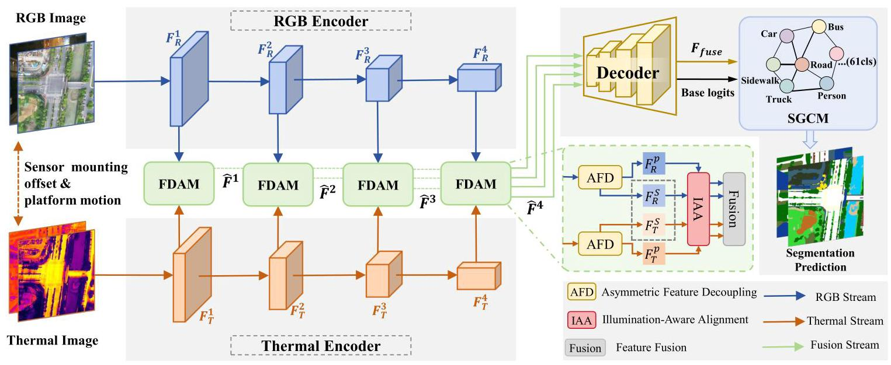

Fig. 3. Overview of GSCNet. RGB and thermal images are processed by two modality-specific MiT-B4 encoders, and FDAM is inserted at all four stages for cross-modal feature interaction. Within FDAM, AFD decomposes features into shared structural and private perceptual components, while IAA performs illumination-aware bidirectional deformable alignment in the shared subspace. The aligned multi-scale features are fused by the decoder to produce ${\mathbf{F}}_{\text{ fuse }}$ and initial logits ${\mathbf{L}}_{0}$ , which are further calibrated by SGCM via graph-attention reasoning over a structured category graph with hierarchical and co-occurrence regularities to obtain the final segmentation.

2) Illumination-Aware Alignment (IAA): AFD reduces the modality gap but leaves residual geometric offsets. As illustrated in Fig. 4(b), IAA corrects these offsets through bidirectional offset estimation, deformable warping, and illumination-aware anchor selection. At each stage $i$ , two lightweight offset predictors first estimate the warps for the two possible alignment directions: ${\mathcal{D}}_{f}^{\left( i\right) }$ keeps RGB fixed and warps thermal toward it, whereas ${\mathcal{D}}_{b}^{\left( i\right) }$ keeps thermal fixed and warps RGB toward it:

(3)

$$
\left( {\Delta {\mathbf{p}}_{f}^{\left( i\right) },{\mathbf{m}}_{f}^{\left( i\right) }}\right)  = {\mathcal{D}}_{f}^{\left( i\right) }\left( {{F}_{R}^{s\left( i\right) }\parallel {F}_{T}^{s\left( i\right) }}\right) ,
$$

$$
\left( {\Delta {\mathbf{p}}_{b}^{\left( i\right) },{\mathbf{m}}_{b}^{\left( i\right) }}\right)  = {\mathcal{D}}_{b}^{\left( i\right) }\left( {{F}_{T}^{s\left( i\right) }\parallel {F}_{R}^{s\left( i\right) }}\right) .
$$

Each predictor specializes in a single warp direction, reducing the complexity of offset estimation.

We apply the estimated offsets via deformable convolutions to warp the shared structural features:

(4)

$$
{\widetilde{F}}_{T}^{s\left( i\right) } = \operatorname{DCN}\left( {{F}_{T}^{s\left( i\right) },\Delta {\mathbf{p}}_{f}^{\left( i\right) },{\mathbf{m}}_{f}^{\left( i\right) }}\right) ,
$$

$$
{\widetilde{F}}_{R}^{s\left( i\right) } = \operatorname{DCN}\left( {{F}_{R}^{s\left( i\right) },\Delta {\mathbf{p}}_{b}^{\left( i\right) },{\mathbf{m}}_{b}^{\left( i\right) }}\right) .
$$

A fixed reference modality fails across illumination changes: RGB provides sharper boundaries in daytime, while thermal provides more reliable structure at night. IAA uses a lightweight router to predict a global image-level illumination-aware weight $\lambda  \in  \left\lbrack  {0,1}\right\rbrack$ , shared by all stages, through $\lambda  = \sigma \left( {\operatorname{MLP}\left( {\operatorname{GAP}\left( {\mathbf{I}}_{\text{ rgb }}\right) }\right) }\right)$ , where GAP is global average pooling and the two-layer MLP has hidden dimension 16 with fewer than $1\mathrm{\;K}$ parameters. The warped and original features are softly blended according to $\lambda$ :

(5)

$$
{\widehat{F}}_{T}^{s\left( i\right) } = \lambda  \cdot  {\widetilde{F}}_{T}^{s\left( i\right) } + \left( {1 - \lambda }\right)  \cdot  {F}_{T}^{s\left( i\right) },
$$

$$
{\widehat{F}}_{R}^{s\left( i\right) } = \left( {1 - \lambda }\right)  \cdot  {\widetilde{F}}_{R}^{s\left( i\right) } + \lambda  \cdot  {F}_{R}^{s\left( i\right) }.
$$

When $\lambda  \rightarrow  1$ , thermal is pulled toward the RGB frame; when $\lambda  \rightarrow  0$ , RGB is pulled toward the thermal frame. The aligned representation thus follows whichever modality is structurally more trustworthy under the current illumination. Because the decoder later combines shared and private features, the private branches should reside in the same reference frame. We therefore reuse the same geometric offsets for the private branches, while keeping modality-specific learnable DCN weights ${\mathbf{W}}_{f}^{p\left( i\right) }$ and ${\mathbf{W}}_{b}^{p\left( i\right) }$ (initialized as center-one identity kernels) to account for their different appearance statistics.

3) Feature Fusion: Following the disentangle-then-fuse strategy [39], we concatenate and compress the aligned shared features from both modalities, then append the two private branches to form the stage-wise fused feature:

$$
{\widehat{F}}^{\left( i\right) } = {\operatorname{Conv}}_{1 \times  1}\left( {{\widehat{F}}_{R}^{s\left( i\right) }\parallel {\widehat{F}}_{T}^{s\left( i\right) }}\right) \begin{Vmatrix}{\widehat{F}}_{R}^{p\left( i\right) }\end{Vmatrix}{\widehat{F}}_{T}^{p\left( i\right) }, \tag{6}
$$

where $\parallel$ denotes channel-wise concatenation and ${\operatorname{Conv}}_{1 \times  1}$ halves the channel dimension to keep the representation compact. The decoder aggregates ${\left\{  {\widehat{F}}^{\left( i\right) }\right\}  }_{i = 1}^{4}$ across all four stages and produces the fused feature map ${\mathbf{F}}_{\text{ fuse }}$ and base logits ${\mathbf{L}}_{0}$ .

## C. Semantic Graph Calibration Module (SGCM)

After FDAM reduces spatial offsets, the dominant remaining errors are semantic. Many UAV categories look alike at local scale, and convolutions that aggregate nearby appearance cues cannot capture their inter-class relations. Tail categories suffer further because they provide too few pixels to learn stable decision boundaries from local context alone. SGCM builds a learnable category graph from ${\mathbf{F}}_{\text{ fuse }}$ and ${\mathbf{L}}_{0}$ , using hierarchical taxonomy and co-occurrence priors to calibrate the base logits through graph reasoning [23], [24].

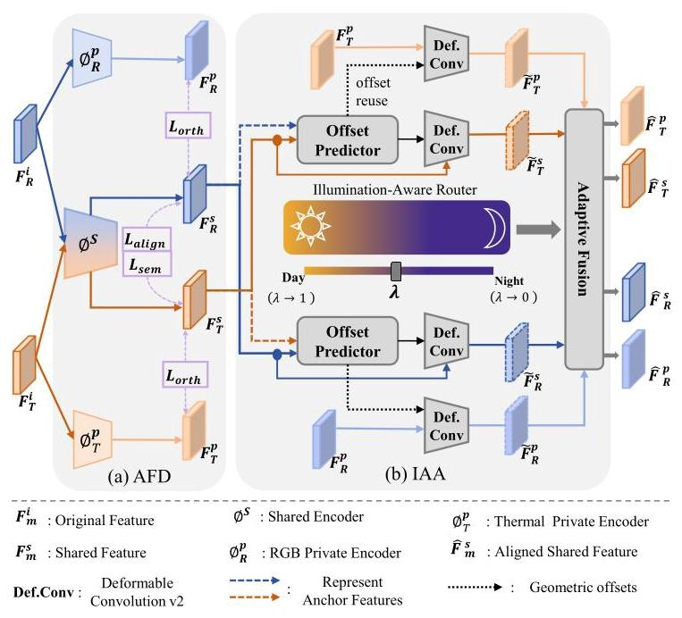

Fig. 4. Overview of FDAM. (a) Asymmetric Feature Decoupling (AFD): separates each modality's features into shared structural and private perceptual components. (b) Illumination-Aware Alignment (IAA): bidirectional deformable alignment with adaptive anchor selection guided by illumination weight $\lambda$ .

1) Category Graph and Prior Adjacency: We define the category graph as $\mathcal{G} = \left( {\mathcal{V},\mathcal{E},\widetilde{\mathbf{A}}}\right)$ , where $\mathcal{V} = \left\{  {{v}_{1},\ldots ,{v}_{K}}\right\}$ corresponds to the $K$ semantic categories and $\widetilde{\mathbf{A}} \in  {\mathbb{R}}^{K \times  K}$ is the prior-guided adjacency defined below. The node features ${\mathbf{H}}^{\left( 0\right) }$ are image-specific and constructed in Sec. III-C2; this subsection therefore focuses on the edges, which encode category-level relational priors that are otherwise hard to learn from local appearance alone.

As illustrated in Fig. 5(a), we initialize the edges with two complementary priors to provide a structured starting point for learning. Hierarchical similarity $\left( {\mathbf{A}}_{H}\right)$ [26]. We organize the 61 categories into a three-level taxonomy with 6 top-level groups and define ${\mathbf{A}}_{H}\left( {i, j}\right)  = \exp \left( {-d\left( {i, j}\right) /s}\right)$ , where $d\left( {i, j}\right)$ is the tree path distance and $s = {2.0}$ . Categories sharing a common parent (e.g., traffic sign, streetlight, traffic light) receive strong edge weights, enabling rare categories to propagate context through their taxonomic neighbors during graph reasoning. Contextual co-occurrence $\left( {\mathbf{A}}_{C}\right)$ [27]. We also encode how often categories appear together in training images: ${\mathbf{A}}_{C}\left( {i, j}\right)  = N\left( {{C}_{i} \cap  {C}_{j}}\right) /\max \left( {N\left( {C}_{i}\right) , N\left( {C}_{j}\right) }\right)$ , where $N\left( {C}_{i}\right)$ counts training images containing category $i$ . The normalization suppresses head-category dominance while preserving scene-level contextual compatibility.

Fig. 6 visualizes the two sources: ${\mathbf{A}}_{H}$ exhibits a clustered structure where intra-group weights are large and intergroup weights are near zero, mirroring the taxonomy; ${\mathbf{A}}_{C}$ captures scene-level co-occurrence patterns that cut across taxonomic boundaries. We combine them as ${\mathbf{A}}_{\text{ raw }} = {0.6}{\mathbf{A}}_{H} + \; {0.4}{\mathbf{A}}_{C}$ and then symmetrize and normalize the result $\left( {{\mathbf{A}}_{p} = }\right. \; \left. {{\mathbf{D}}^{-1/2}\overline{\mathbf{A}}{\mathbf{D}}^{-1/2},\overline{\mathbf{A}} = {0.5}\left( {{\mathbf{A}}_{\text{ raw }} + {\mathbf{A}}_{\text{ raw }}^{\top }}\right) }\right)$ to obtain the prior adjacency. Static priors cannot cover all inter-class correlations in the training data. For instance, visually similar but taxonomically distant categories may still confuse the classifier. We add a learnable residual ${\mathbf{A}}_{\delta } \in  {\mathbb{R}}^{K \times  K}$ , initialized to zero, that strengthens such data-driven relations during training. The final adjacency is:

(7)

$$
{\mathbf{A}}_{\text{ upd }} = \operatorname{ReLU}\left( {{\mathbf{A}}_{p} + {\mathbf{A}}_{\delta }}\right)
$$

$$
\widetilde{\mathbf{A}} = \operatorname{SymNorm}\left( {{0.5}\left( {{\mathbf{A}}_{\text{ upd }} + {\mathbf{A}}_{\text{ upd }}^{\top }}\right) }\right) ,
$$

where $\mathbf{D}$ is the degree matrix and SymNorm $\left( \cdot \right)  = \; {\mathbf{D}}^{-1/2}\left( \cdot \right) {\mathbf{D}}^{-1/2}$ denotes symmetric degree normalization. An ${\ell }_{1}$ penalty ${\mathcal{L}}_{\mathrm{{kg}}}$ (Section III-D) keeps ${\mathbf{A}}_{\delta }$ sparse, so the model can adapt the prior without drifting too far from the dataset structure.

2) Image-Specific Dynamic Aggregation: As shown in Fig. 5(b), SGCM initializes every node from the current image through soft attention pooling. The base logits ${\mathbf{L}}_{0}$ are converted into per-class spatial attention maps via softmax, and ${\mathbf{F}}_{\text{ fuse }}$ is aggregated over all spatial locations for each class to produce the initial node feature:

$$
{\mathbf{H}}_{b, k}^{\left( 0\right) } = \frac{\mathop{\sum }\limits_{{h, w}}{\operatorname{softmax}}_{k}{\left( {\mathbf{L}}_{0}\right) }_{b, k, h, w} \cdot  {\mathbf{F}}_{\text{ fuse }, b, : , h, w}}{\mathop{\sum }\limits_{{h, w}}{\operatorname{softmax}}_{k}{\left( {\mathbf{L}}_{0}\right) }_{b, k, h, w} + \epsilon }, \tag{8}
$$

where $\epsilon  = {10}^{-6}$ . Soft attention pooling lets ambiguous pixels contribute to multiple candidate nodes according to their current confidence, which reduces error propagation from hard assignment. Because pooling is image-specific, the node features reflect the actual category composition of the current scene.

3) Prior-Biased Graph Reasoning: Once the nodes are initialized, we refine them with a prior-biased GAT [40] (Fig. 5(c)). We inject the prior adjacency $\widetilde{\mathbf{A}}$ as an additive bias into the attention logits, so that category pairs with stronger prior affinity receive proportionally larger attention weights:

$$
{e}_{ij} = \operatorname{LeakyReLU}\left( {{\mathbf{a}}^{\top }\left\lbrack  {{\mathbf{{Wh}}}_{i}\parallel {\mathbf{{Wh}}}_{j}}\right\rbrack  }\right) , \tag{9}
$$

$$
{\alpha }_{ij} = {\operatorname{softmax}}_{j}\left( {{e}_{ij} + \log \left( {{\widetilde{\mathbf{A}}}_{ij} + \epsilon }\right) }\right) , \tag{10}
$$

where ${e}_{ij}$ is the standard GAT attention logit from node $i$ to node $j,{\mathbf{h}}_{i}$ and ${\mathbf{h}}_{j}$ are the current feature vectors of the two nodes, $\mathbf{W}$ is a learnable linear projection matrix, a is a learnable attention weight vector, $\parallel$ denotes concatenation, and ${\widetilde{\mathbf{A}}}_{ij}$ is the $\left( {i, j}\right)$ -th entry of the fused prior adjacency matrix defined in Eq. (7). The additive log ${\widehat{\mathbf{A}}}_{ij}$ term biases the attention toward category pairs with stronger prior affinity. Edges with ${\widetilde{\mathbf{A}}}_{ij} < {10}^{-5}$ are hard-masked to $- \infty$ before softmax (ensuring $\log \left( {{\widetilde{\mathbf{A}}}_{ij} + \epsilon }\right)$ is well-defined for retained edges), defining the effective neighborhood $\mathcal{N}\left( i\right)  = \left\{  {j \mid  {\widetilde{\mathbf{A}}}_{ij} \geq  {10}^{-5}}\right\}$ . Because ${\widetilde{\mathbf{A}}}_{ij} \in  (0,1\rbrack$ , the logarithmic bias is non-positive and favors edges with stronger prior support.

We use a two-layer, 4-head GAT, concatenating the multihead outputs in the first layer and averaging them in the second. The refined node features ${\mathbf{H}}_{\text{ ref }} \in  {\mathbb{R}}^{B \times  K \times  D}\left( {D = {512}}\right)$ are projected back to the spatial domain via ${\mathbf{L}}_{g, b, k, h, w} = \; {\mathbf{H}}_{\text{ ref }, b, k}^{\top }{\mathbf{F}}_{\text{ fuse }, b, : , h, w}$ . The final prediction fuses the base and graph logits as $\mathbf{L} = \gamma  \cdot  {\mathbf{L}}_{0} + \left( {1 - \gamma }\right)  \cdot  {\mathbf{L}}_{g}$ with $\gamma  = {0.85}$ (Section V-C). This fusion acts as a residual semantic calibration: ${\mathbf{L}}_{0}$ preserves sharp spatial detail, while ${\mathbf{L}}_{g}$ corrects class-level confusion by letting rare and visually ambiguous categories borrow discriminative context from semantically related nodes through the prior-guided graph.

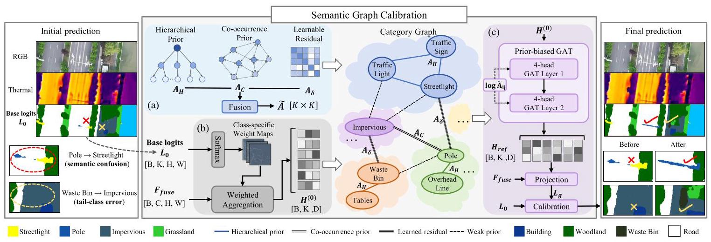

Fig. 5. Overview of SGCM. Left: the initial prediction exhibits two typical failure modes: semantic confusion (Pole $\rightarrow$ Streetlight) and tail-class misclassification (Waste Bin $\rightarrow$ Impervious). (a) The learnable adjacency $\widetilde{\mathbf{A}}$ is built from ${\mathbf{A}}_{H},{\mathbf{A}}_{C}$ , and ${\mathbf{A}}_{\delta }$ ; the category graph shows representative edge types: hierarchical (e.g., Traffic Light-Streetlight), co-occurrence (e.g., Pole-Impervious), and learned residual (e.g., Waste Bin-Impervious). (b) Base logits ${\mathbf{L}}_{0}$ generate class-specific weight maps for aggregating node features ${\mathbf{H}}^{\left( 0\right) }$ from ${\mathbf{F}}_{\text{ fuse }}$ . (c) A prior-biased GAT refines node embeddings and projects them back to produce graph logits ${\mathbf{L}}_{g}$ , which are residually fused with ${\mathbf{L}}_{0}$ for final prediction. Right: the calibrated prediction corrects both error types.

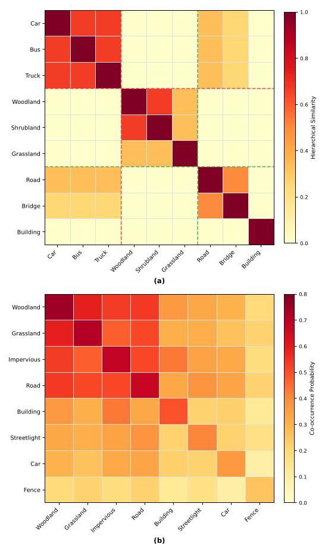

Fig. 6. Visualization of the two static prior matrices in SGCM for representative categories. (a) Hierarchical similarity $\left( {\mathbf{A}}_{H}\right)$ : block-diagonal structure reflects taxonomic groupings. (b) Co-occurrence probability $\left( {\mathbf{A}}_{C}\right)$ : encodes scene-level contextual compatibility.

## D. Loss Function

The network is trained end-to-end with the following objective:

$$
{\mathcal{L}}_{\text{ total }} = {\mathcal{L}}_{\text{ seg }} + {\lambda }_{\mathrm{{dis}}}{\mathcal{L}}_{\mathrm{{dis}}} + {\lambda }_{\mathrm{{kg}}}{\mathcal{L}}_{\mathrm{{kg}}}, \tag{11}
$$

where ${\mathcal{L}}_{\text{ seg }}$ is the OHEM cross-entropy loss on the final prediction with hard-pixel threshold $\theta  = {0.7};{\mathcal{L}}_{\text{ kg }} = {\begin{Vmatrix}{\mathbf{A}}_{\delta }\end{Vmatrix}}_{1}$ is an ${\ell }_{1}$ penalty that keeps the learnable residual adjacency sparse; and ${\mathcal{L}}_{\text{ dis }}$ aggregates the three AFD constraints across all four encoder stages:

$$
{\mathcal{L}}_{\text{ dis }} = \frac{1}{4}\mathop{\sum }\limits_{{i = 1}}^{4}\left( {{\lambda }_{\text{ align }}{\mathcal{L}}_{\text{ align }}^{\left( i\right) } + {\lambda }_{\text{ sem }}{\mathcal{L}}_{\text{ sem }}^{\left( i\right) } + {\lambda }_{\text{ orth }}{\mathcal{L}}_{\text{ orth }}^{\left( i\right) }}\right) . \tag{12}
$$

The decoupling weight ${\lambda }_{\text{ dis }} = {0.1}$ and the graph fusion weight $\gamma  = {0.85}$ are selected based on the sensitivity analysis in Section V-C. The remaining weights are set to ${\lambda }_{\text{ align }} = {0.2}$ , ${\lambda }_{\text{ sem }} = {0.1},{\lambda }_{\text{ orth }} = {0.05}$ , and ${\lambda }_{\text{ kg }} = {0.01}$ throughout all experiments.

## IV. URTF BENCHMARK

## A. Comparison with Existing Datasets

Table I summarizes existing RGB-T benchmarks. Most were collected from ground-level platforms [4]-[6], [9], and the few UAV-oriented datasets remain limited in scale or annotation granularity [12], [13]. No previous RGB-T benchmark provides more than 36 semantic categories, so fine-grained classes such as vehicle subtypes are merged into a single label. Most also assume strict pixel-level registration, which is hard to achieve on real dual-sensor UAV platforms. URTF targets aerial scenes, expands the label space to 61 fine-grained categories, and preserves the cross-modal offsets produced by practical hardware.

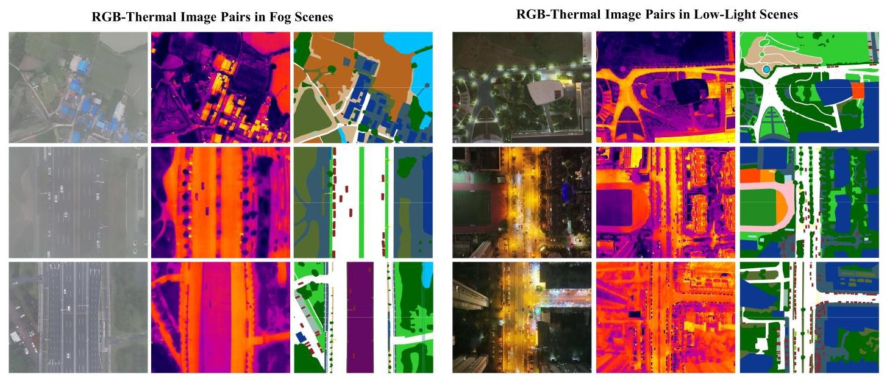

Fig. 7. RGB, thermal, and semantic annotation examples in URTF. The left side shows groups of RGB images, thermal images, and ground-truth labels captured under cloudy/foggy conditions with increasing fog density. The right side presents groups obtained under low-light conditions, ranging from evening to late night.

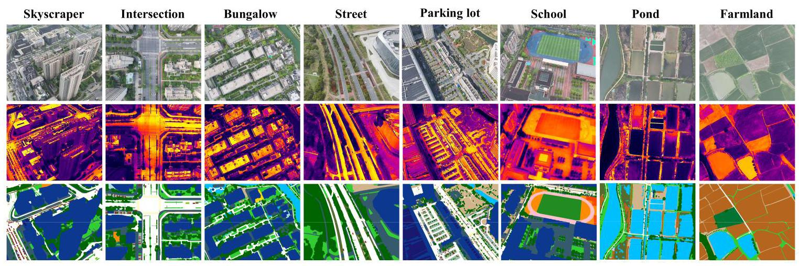

Fig. 8. Key scenes in the URTF dataset: Skyscraper, Intersection, Bungalow, Street, Parking Lot, School, Pond, and Farmland, all captured at altitudes of 50-300m.

## B. Dataset Construction

We collect URTF with DJI M30T and DJI Matrice 3TD drones at altitudes of ${50} - {300}\mathrm{\;m}$ over urban, suburban, farmland, and water-body scenes (Fig. 8). Each drone carries a dual-sensor gimbal with a high-resolution RGB camera and a ${640} \times  {512}$ thermal camera. The fixed physical offset between the two sensors gives each RGB-T pair an approximate shared field of view but no exact pixel correspondence.

We resize and crop RGB frames to ${640} \times  {512}$ to match the thermal resolution. No manual fine alignment, automated registration, or post-hoc correction is applied. Throughout this paper, unaligned means that the two modalities cover approximately the same scene area without pixel-to-pixel geometric correspondence.

We keep this unaligned setting to match practical UAV deployment. On real dual-sensor payloads, the RGB and thermal cameras have different optical centers, focal lengths, and imaging resolutions. Their relative displacement changes with flight altitude, object depth, and platform motion. A calibration matrix estimated on one scene cannot remove local offsets in another, especially near object boundaries or elevated structures such as buildings, poles, and vehicles. Global registration before annotation would also introduce interpolation artifacts and distort thin objects. URTF therefore preserves sensor-level offsets and tests whether segmentation models can learn robust fusion under these native conditions.

URTF contains 61 semantic categories organized into a 3-level taxonomy with 6 top-level groups (Fig. 9). We annotate the modality that provides clearer structures under each condition: RGB for daytime captures and thermal for nighttime captures (Fig. 7). The ground-truth labels therefore reside in the reference frame of the annotated modality, so any cross-modal fusion method must handle this reference-frame variation as part of the alignment challenge. We use an internal pre-trained segmentation model to initialize masks, which are then refined through expert review. This pipeline covers 99.992% of all pixels. To increase scene diversity and mitigate the long-tailed distribution, we add 8625 synthetic image pairs rendered in AirSim and CARLA, which enrich rare scene configurations and under-represented tail categories.

TABLE I

COMPARISON OF URTF WITH OTHER DATASETS. DATA: DATA COMPOSITION. REG.: REGISTRATION (STRICT = PIXEL-LEVEL; NONE = UNALIGNED). FINE.: FINE-GRAINED. RES.: RESOLUTION. %ANNO.: ANNOTATED-PIXEL RATIO. ENTRIES MARKED WITH "-" ARE NOT REPORTED.

<table><tr><td>Category</td><td>Dataset</td><td>Year</td><td>RGB</td><td>Thermal</td><td>UAV</td><td>Data</td><td>Reg.</td><td>Fine.</td><td>#Imgs</td><td>#Cls</td><td>Res.</td><td>%Anno.</td></tr><tr><td rowspan="3">RGB</td><td>UAVid [2]</td><td>2020</td><td>✓</td><td>✘</td><td>✓</td><td>Real</td><td>-</td><td>✘</td><td>420</td><td>8</td><td>${3840} \times  {2160}$</td><td>82.69</td></tr><tr><td>FloodNet [41]</td><td>2021</td><td>✓</td><td>✘</td><td>✓</td><td>Real</td><td>-</td><td>✘</td><td>2,343</td><td>10</td><td>4000×3000</td><td>-</td></tr><tr><td>VDD [42]</td><td>2025</td><td>✓</td><td>✘</td><td>✓</td><td>Real</td><td>-</td><td>✘</td><td>400</td><td>7</td><td>4000×3000</td><td>-</td></tr><tr><td rowspan="9">RGB-T</td><td>MFNet [5]</td><td>2017</td><td>✓</td><td>✓</td><td>✘</td><td>Real</td><td>Strict</td><td>✘</td><td>1,569</td><td>9</td><td>640×480</td><td>7.86</td></tr><tr><td>PST900 [6]</td><td>2020</td><td>✓</td><td>✓</td><td>✘</td><td>Real</td><td>Strict</td><td>✘</td><td>894</td><td>5</td><td>1280×720</td><td>3.02</td></tr><tr><td>SemanticRT [43]</td><td>2023</td><td>✓</td><td>✓</td><td>✘</td><td>Real</td><td>Strict</td><td>✘</td><td>11,371</td><td>13</td><td>1280×1024</td><td>21.27</td></tr><tr><td>FMB [9]</td><td>2023</td><td>✓</td><td>✓</td><td>✘</td><td>Real</td><td>Strict</td><td>✘</td><td>1,500</td><td>15</td><td>800×600</td><td>98.16</td></tr><tr><td>CART [11]</td><td>2024</td><td>✓</td><td>✓</td><td>✓</td><td>Real</td><td>Strict</td><td>✘</td><td>2,282</td><td>11</td><td>960×600</td><td>99.98</td></tr><tr><td>MVSeg [10]</td><td>2024</td><td>✓</td><td>✓</td><td>✘</td><td>Real</td><td>Strict</td><td>✘</td><td>3,545</td><td>26</td><td>480×640</td><td>98.96</td></tr><tr><td>MVUAV [12]</td><td>2024</td><td>✓</td><td>✓</td><td>✓</td><td>Real</td><td>Strict</td><td>✘</td><td>2,183</td><td>36</td><td>1920×1080</td><td>99.18</td></tr><tr><td>Kust4K [13]</td><td>2025</td><td>✓</td><td>✓</td><td>✓</td><td>Real</td><td>Strict</td><td>✘</td><td>4,024</td><td>8</td><td>640×512</td><td>77.34</td></tr><tr><td>U-MFNet [34]</td><td>2025</td><td>✓</td><td>✓</td><td>✘</td><td>Synth.</td><td>None</td><td>✘</td><td>1.569</td><td>9</td><td>640×480</td><td>7.86</td></tr><tr><td></td><td>URTF (Ours)</td><td>-</td><td>✓</td><td>✓</td><td>✓</td><td>Real+Synth.</td><td>None</td><td>✓</td><td>25,519</td><td>61</td><td>640×512</td><td>99.992</td></tr></table>

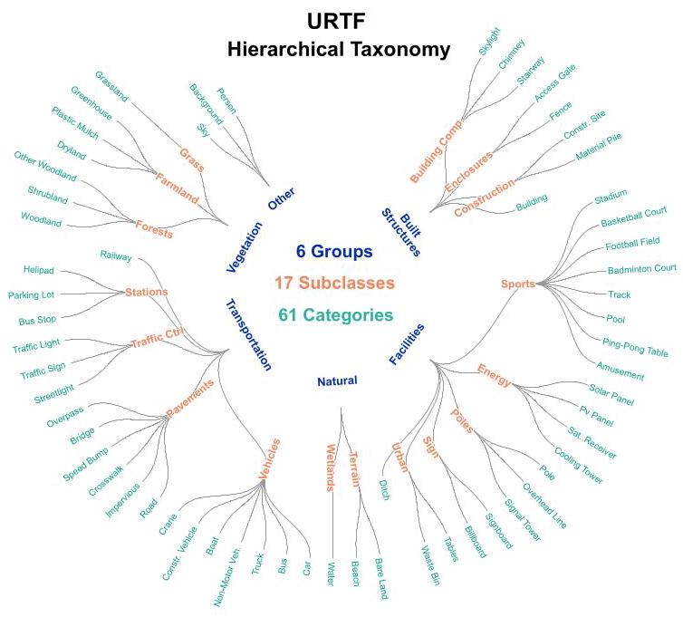

Fig. 9. Hierarchical taxonomy of semantic categories in URTF. Blue, orange, and green labels denote top-level groups, intermediate subclasses, and leaf categories, respectively.

30 professional annotators labeled URTF for 6 months at 8 hours per day, totaling more than 28,000 person-hours. Every image pair passed through three independent rounds of expert inspection; inaccurate or ambiguous labels were returned for correction before advancing to the next round.

## C. Dataset Statistics and Core Challenges

URTF contains 25,519 RGB-T image pairs, including 16,894 real samples and 8,625 synthetic ones. We use 20,393 pairs for training and 5,126 for validation, roughly a 4:1 split, and keep the validation set entirely real-world. In terms of illumination and weather conditions, all 25,519 image pairs are distributed across three distinct scenarios: 14,844 daytime, 6,900 foggy, and 3,775 low-light, covering the diverse sensing conditions encountered in practical UAV deployments.

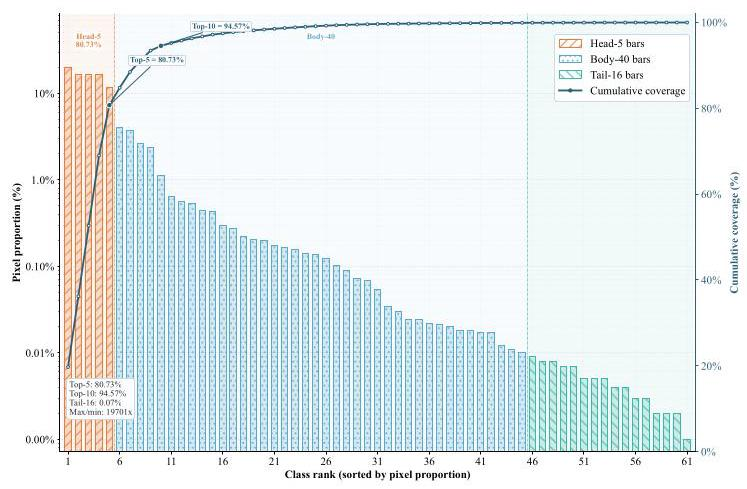

Fig. 10. Long-tailed pixel distribution of the 61 semantic categories in URTF. Categories are sorted by pixel proportion, with the Head-5, Body-40, and Tail- 16 partitions highlighted together with the cumulative pixel coverage.

The benchmark is challenging for three reasons. First, cross-modal spatial misalignment caused by sensor parallax and vibration cannot be removed by a single global transform. Second, the class distribution is severely long-tailed: the top-5 categories already occupy 80.73% of all pixels, whereas 51 of the 61 classes each account for less than 1% (Fig. 10). Third, many categories remain difficult to distinguish from the UAV viewpoint, including Woodland/Shrubland, Road/Impervious, and several vehicle subtypes. The five head categories (Road, Woodland, Building, Grassland, Impervious) together occupy 80.73% of pixels, while the 16 tail categories (e.g., Crane, Helipad, Cooling Tower, Greenhouse) each contribute less than 0.01%.

## V. EXPERIMENTS

We evaluate GSCNet against state-of-the-art methods on the URTF validation set under a unified protocol without test-time augmentation.

TABLE II

QUANTITATIVE COMPARISON WITH STATE-OF-THE-ART METHODS ON URTF. MIOU: MEAN INTERSECTION OVER UNION ACROSS ALL 61 CATEGORIES. MACC: MEAN PER-CLASS ACCURACY. AACC: OVERALL PIXEL ACCURACY. HEAD-5: MEAN IOU OF THE 5 DOMINANT CATEGORIES THAT COLLECTIVEL: ACCOUNT FOR 80.73% OF ALL PIXELS. TAIL-16: MEAN IOU OF THE 16 RAREST CATEGORIES, EACH OCCUPYING LESS THAN 0.01% OF PIXELS. METHODS LISTED UNDER RGB-T Fusion USE PAIRED RGB-T INPUTS. BOLD RED: BEST; BOLD BLUE: SECOND BEST.

<table><tr><td>Method</td><td>Pub.</td><td>Modality</td><td>mIoU (%)</td><td>mAcc (%)</td><td>aAcc (%)</td><td>Head-5 (%)</td><td>Tail-16 (%)</td></tr><tr><td colspan="8">RGB-only Methods</td></tr><tr><td>DeepLabv3+ [22]</td><td>ECCV '18</td><td>RGB</td><td>53.63</td><td>66.05</td><td>88.51</td><td>81.53</td><td>33.35</td></tr><tr><td>HRNet [44]</td><td>CVPR '19</td><td>RGB</td><td>56.63</td><td>65.66</td><td>88.92</td><td>81.73</td><td>40.70</td></tr><tr><td>SegFormer [37]</td><td>NeurIPS '21</td><td>RGB</td><td>60.05</td><td>69.53</td><td>89.58</td><td>82.72</td><td>45.79</td></tr><tr><td>Mask2Former [45]</td><td>CVPR '22</td><td>RGB</td><td>59.64</td><td>71.56</td><td>88.44</td><td>81.49</td><td>45.28</td></tr><tr><td>SegNeXt [46]</td><td>NeurIPS '22</td><td>RGB</td><td>59.22</td><td>70.22</td><td>89.34</td><td>82.33</td><td>44.36</td></tr><tr><td>EFENet [47]</td><td>TGRS '24</td><td>RGB</td><td>59.83</td><td>70.71</td><td>89.08</td><td>81.94</td><td>46.97</td></tr><tr><td colspan="8">Thermal-only Methods</td></tr><tr><td>DeepLabv3+ [22]</td><td>ECCV '18</td><td>Thermal</td><td>24.45</td><td>31.96</td><td>75.59</td><td>63.85</td><td>7.69</td></tr><tr><td>HRNet [44]</td><td>CVPR '19</td><td>Thermal</td><td>27.87</td><td>33.23</td><td>78.44</td><td>66.65</td><td>11.44</td></tr><tr><td>SegFormer [37]</td><td>NeurIPS '21</td><td>Thermal</td><td>34.95</td><td>42.29</td><td>80.32</td><td>69.26</td><td>18.94</td></tr><tr><td>Mask2Former [45]</td><td>CVPR '22</td><td>Thermal</td><td>28.54</td><td>36.99</td><td>77.99</td><td>67.48</td><td>6.99</td></tr><tr><td>SegNeXt [46]</td><td>NeurIPS '22</td><td>Thermal</td><td>32.81</td><td>39.08</td><td>80.26</td><td>69.32</td><td>16.51</td></tr><tr><td>EFENet [47]</td><td>TGRS '24</td><td>Thermal</td><td>33.00</td><td>40.12</td><td>80.01</td><td>68.64</td><td>18.69</td></tr><tr><td colspan="8">RGB-T Fusion Methods</td></tr><tr><td>EGFNet [17]</td><td>AAAI '22</td><td>RGB-T</td><td>48.74</td><td>52.53</td><td>84.21</td><td>74.59</td><td>18.59</td></tr><tr><td>CMX [7]</td><td>TITS '23</td><td>RGB-T</td><td>60.31</td><td>69.19</td><td>90.80</td><td>84.52</td><td>45.58</td></tr><tr><td>CMNext [48]</td><td>CVPR '23</td><td>RGB-T</td><td>62.78</td><td>75.18</td><td>90.78</td><td>84.58</td><td>49.67</td></tr><tr><td>SGFNet [49]</td><td>TCSVT '23</td><td>RGB-T</td><td>62.41</td><td>75.38</td><td>91.08</td><td>82.97</td><td>48.22</td></tr><tr><td>CRM [50]</td><td>ICRA '24</td><td>RGB-T</td><td>67.78</td><td>77.01</td><td>91.91</td><td>86.78</td><td>55.46</td></tr><tr><td>GeminiFusion [51]</td><td>ICML '24</td><td>RGB-T</td><td>61.73</td><td>71.46</td><td>90.63</td><td>84.34</td><td>46.89</td></tr><tr><td>MRFS [10]</td><td>CVPR '24</td><td>RGB-T</td><td>65.28</td><td>75.13</td><td>91.29</td><td>84.21</td><td>53.87</td></tr><tr><td>ASANet [52]</td><td>ISPRS '24</td><td>RGB-X</td><td>53.91</td><td>63.30</td><td>90.78</td><td>84.01</td><td>25.53</td></tr><tr><td>MiLNet [53]</td><td>TIP '25</td><td>RGB-T</td><td>61.29</td><td>68.97</td><td>91.12</td><td>85.08</td><td>41.88</td></tr><tr><td>DFormerV2 [54]</td><td>CVPR '25</td><td>RGB-X</td><td>64.94</td><td>74.91</td><td>91.23</td><td>84.96</td><td>53.73</td></tr><tr><td>AMDANet [55]</td><td>ICCV '25</td><td>RGB-T</td><td>68.13</td><td>75.46</td><td>91.49</td><td>85.37</td><td>54.77</td></tr><tr><td>Mul-VMamba [56]</td><td>KBS '26</td><td>RGB-T</td><td>64.92</td><td>74.03</td><td>91.34</td><td>85.33</td><td>52.47</td></tr><tr><td>MambaSeg [57]</td><td>AAAI '26</td><td>RGB-X</td><td>68.31</td><td>76.62</td><td>92.47</td><td>87.28</td><td>55.54</td></tr><tr><td>GSCNet (Ours)</td><td>-</td><td>RGB-T</td><td>71.04</td><td>78.97</td><td>92.65</td><td>87.40</td><td>60.17</td></tr></table>

## A. Implementation Details

GSCNet uses MiT-B4 [37] (ImageNet-1K pre-trained) as the backbone and is implemented in PyTorch on a single NVIDIA H20 GPU. All methods, including GSCNet, are trained for 50 epochs with batch size 12, AdamW optimizer (lr $1 \times  {10}^{-4}$ , weight decay 0.01), poly LR schedule with 5-epoch warmup, an input resolution of ${640} \times  {512}$ , and identical augmentation (random crop, horizontal flip, multi-scale resizing \{0.5- 1.75\}, photometric distortion). GSCNet-specific loss weights are ${\lambda }_{\text{ dis }} = {0.1},{\lambda }_{\mathrm{{kg}}} = {0.01}$ . Each comparison method retains its official backbone; the three RGB-X methods (ASANet, DFormerV2, MambaSeg) only modify the input layer to accept RGB-T input. No test-time augmentation or cross-modal pre-alignment is applied, preserving realistic sensor offsets.

## B. Comparison with State-of-the-Art Methods

We compare GSCNet with 19 methods across 25 configurations spanning RGB-only, thermal-only, RGB-T fusion, and RGB-X cross-modal settings, with the full results reported in Table II. The three RGB-X models, ASANet, DFormerV2, and MambaSeg, were originally developed for RGB-SAR, RGB-D, and RGB-event segmentation and are retrained on URTF under the same protocol as cross-modal generalization baselines. For fairness, MRFS [10] and AMDANet [55], which jointly optimize image fusion and semantic segmentation, are evaluated here only on the segmentation metric.

GSCNet reaches 71.04% mIoU on URTF, exceeding Mam-baSeg by 2.73%, AMDANet by 2.91%, and SegFormer (strongest RGB-only baseline) by 10.99%. The gap widens on tail categories: GSCNet obtains 60.17% Tail-16 IoU versus 55.54% for MambaSeg and 54.77% for AMDANet. Models without misalignment handling, such as EGFNet (48.74%), fail to exploit the thermal modality, and even the best competing fusion methods trail GSCNet by 4.63-5.40% on Tail-16, showing that fusion alone cannot resolve fine-grained tail categories without dedicated alignment and semantic reasoning.

Adding thermal input does not guarantee better segmentation on URTF. Several RGB-T fusion models score below the RGB-only SegFormer baseline. EGFNet and ASANet rely on local consistency between modalities for boundary-level or cross-modal fusion, so misaligned thermal features actively hurt their decoders. Stronger models such as AMDANet and MambaSeg use more flexible cross-modal interaction and partially mitigate this problem, but they still lack explicit mechanisms for local geometric correction and category-level calibration. GSCNet improves both mIoU and Tail-16 because FDAM first reduces feature-level misalignment and SGCM then corrects class-level confusion among rare or visually similar categories.

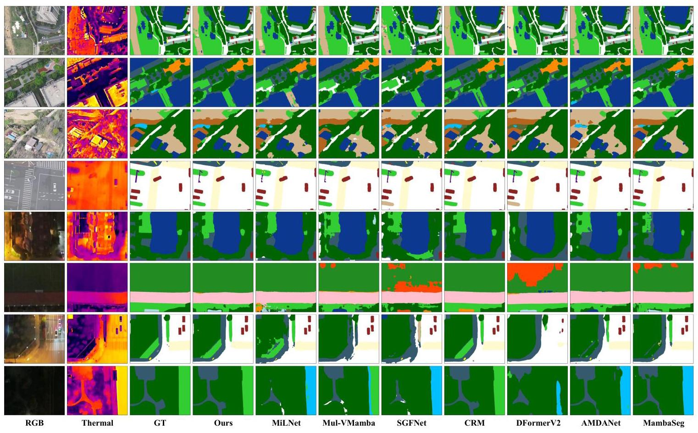

Fig. 11. Visual comparisons among GSCNet and seven competing methods on the URTF benchmark in daytime (first 4 rows) and nighttime (last 4 rows) scenes.

Fig. 11 shows qualitative results. In daytime scenes (rows 1- 4), competing methods produce ghosting artifacts and blurred boundaries because they lack cross-modal alignment. The foggy scene in row 4 amplifies this problem for small targets such as traffic lights and streetlights. In nighttime scenes (rows 5-8), weak RGB texture causes large-area failures and category mislabeling in competing methods. GSCNet produces more stable masks because FDAM aligns structural features before fusion and IAA selects the more reliable modality under varying illumination. The visual differences concentrate on thin structures, small targets, and modality-dependent regions. In daytime rows, RGB provides clear contours, but thermal responses shift around object boundaries and create duplicate activations after naive fusion. In low-light rows, thermal cues become dominant while RGB textures turn noisy or vanish. Methods without adaptive reference selection tend to overfit one modality and fail under the other condition. GSCNet handles both cases because IAA chooses the more reliable reference per image and SGCM suppresses contextually unlikely labels.

Table III shows that GSCNet improves accuracy with competitive model complexity. Compared with MambaSeg, it nearly halves the parameter count (160.66M vs. 315.44M) while improving mIoU from 68.31% to 71.04%. Relative to AMDANet, GSCNet uses comparable FLOPs (208.07G vs. 213.43G) but runs substantially faster (16.62 vs. 11.03 FPS). CRM is both larger and slower, yet remains 3.26% lower in mIoU. This efficiency profile is consistent with SGCM, whose reasoning operates on only 61 category nodes rather than dense spatial grids. The computational overhead mainly comes from the dual MiT-B4 encoders and multi-stage FDAM blocks. SGCM adds limited cost because it reasons over a compact ${61} \times  {61}$ relation space per image rather than dense spatial attention whose cost grows with $H \times  W$ . The current design therefore favors accuracy under difficult unaligned conditions, while leaving room for future compression of the backbone and FDAM components.

## C. Ablation Studies

We analyze FDAM and SGCM under the same training setting as Section V-A. Tables IV-VI report individual and joint effects, and Fig. 13 examines the two key hyperparameters. The ablation baseline is derived from AMDANet [55] after removing the image fusion head and replacing its specialized fusion module with lightweight channel-wise concatenation, yielding 67.63% mIoU and 52.67% Tail-16 on URTF.

TABLE III

COMPARISON OF MODEL COMPLEXITY AND INFERENCE SPEED. FPS IS MEASURED ON A SINGLE NVIDIA H20 GPU AT 640 × 512 RESOLUTION WITH BATCH SIZE 1. BOLD HIGHLIGHTS THE BEST RESULT PER COLUMN.

<table><tr><td>Method</td><td>Backbone</td><td>Params/M</td><td>FLOPs/G</td><td>FPS</td><td>mIoU</td></tr><tr><td colspan="6">RGB-only Methods</td></tr><tr><td>DeepLabv3+ [22]</td><td>Res101</td><td>60.24</td><td>318.00</td><td>44.49</td><td>53.63</td></tr><tr><td>HRNet [44]</td><td>HRNet-W48</td><td>65.89</td><td>117.80</td><td>51.75</td><td>56.63</td></tr><tr><td>SegFormer [37]</td><td>MiT-B4</td><td>61.39</td><td>76.18</td><td>44.68</td><td>60.05</td></tr><tr><td>Mask2Former [45]</td><td>Swin-B</td><td>107.00</td><td>172.00</td><td>24.80</td><td>59.64</td></tr><tr><td>SegNeXt [46]</td><td>MSCAN-L</td><td>48.84</td><td>82.19</td><td>53.15</td><td>59.22</td></tr><tr><td>EFENet [47]</td><td>Twins-L</td><td>143.84</td><td>198.99</td><td>22.01</td><td>59.83</td></tr><tr><td colspan="6">RGB-T Fusion Methods</td></tr><tr><td>EGFNet [17]</td><td>Res152</td><td>62.93</td><td>230.14</td><td>19.62</td><td>48.74</td></tr><tr><td>CMX [7]</td><td>MiT-B4</td><td>143.38</td><td>172.27</td><td>22.80</td><td>60.31</td></tr><tr><td>CMNext [48]</td><td>MiT-B4</td><td>116.59</td><td>154.89</td><td>24.90</td><td>62.78</td></tr><tr><td>SGFNet [49]</td><td>Res50</td><td>125.31</td><td>157.25</td><td>24.04</td><td>62.41</td></tr><tr><td>CRM [50]</td><td>MiT-B4</td><td>193.51</td><td>267.48</td><td>15.60</td><td>67.78</td></tr><tr><td>GeminiFusion [51]</td><td>MiT-B4</td><td>103.32</td><td>271.75</td><td>14.20</td><td>61.73</td></tr><tr><td>MRFS [10]</td><td>MiT-B4</td><td>134.99</td><td>140.65</td><td>19.55</td><td>65.28</td></tr><tr><td>ASANet [52]</td><td>ConvNeXt-T</td><td>82.93</td><td>129.80</td><td>43.20</td><td>53.91</td></tr><tr><td>MiLNet [53]</td><td>MiT-B4</td><td>126.04</td><td>197.33</td><td>22.40</td><td>61.29</td></tr><tr><td>DFormerV2 [54]</td><td>DFormerV2-L</td><td>95.57</td><td>146.88</td><td>17.53</td><td>64.94</td></tr><tr><td>AMDANet [55]</td><td>MiT-B4</td><td>135.76</td><td>213.43</td><td>11.03</td><td>68.13</td></tr><tr><td>Mul-VMamba [56]</td><td>VMamba-T</td><td>112.23</td><td>56.33</td><td>40.40</td><td>64.92</td></tr><tr><td>MambaSeg [57]</td><td>VMamba-T</td><td>315.44</td><td>186.06</td><td>20.92</td><td>68.31</td></tr><tr><td>GSCNet (Ours)</td><td>MiT-B4</td><td>160.66</td><td>208.07</td><td>16.62</td><td>71.04</td></tr></table>

TABLE IV

MODULE-LEVEL ABLATION ON THE URTF VALIDATION SET. GAINS ARE RELATIVE TO THE BASELINE.

<table><tr><td>FDAM</td><td>SGCM</td><td>mIoU (%)</td><td>Tail-16 (%)</td><td>ΔmIoU</td></tr><tr><td></td><td></td><td>67.63</td><td>52.67</td><td>-</td></tr><tr><td>✓</td><td></td><td>70.13</td><td>57.23</td><td>+2.50</td></tr><tr><td></td><td>✓</td><td>70.30</td><td>58.75</td><td>+2.67</td></tr><tr><td>✓</td><td>✓</td><td>71.04</td><td>60.17</td><td>+3.41</td></tr></table>

1) Module-Level Overview: FDAM and SGCM target different error sources. FDAM improves mIoU by 2.50% and SGCM by 2.67%, confirming that spatial misalignment and semantic confusion are both significant bottlenecks. Combining them raises the gain to ${3.41}\%$ , less than the arithmetic sum, which indicates partial overlap but clear complementarity.

The Tail-16 numbers clarify the roles of the two modules. FDAM raises Tail-16 from 52.67% to 57.23%, showing that rare categories also benefit from cleaner cross-modal boundaries. SGCM raises Tail-16 to 58.75%, a larger tail gain than its mIoU gain, consistent with its design goal of using class relations to support rare labels. The full model reaches 60.17%, indicating that rare-category recognition needs both reliable spatial evidence and relational semantic context.

2) FDAM Internal Ablation: We next examine which part of FDAM contributes most. AFD introduces an asymmetric encoder and three loss constraints ( ${\mathcal{L}}_{\text{ align }},{\mathcal{L}}_{\text{ sem }},{\mathcal{L}}_{\text{ orth }}$ ) to separate shared structural cues from modality-private perceptual cues, while IAA estimates deformable offsets in the shared structural space. Most of the gain comes from disentangling structure before alignment. The asymmetric encoder alone brings a 1.21% mIoU gain, and adding the decoupling losses increases it to 1.72%, showing that a cleaner shared subspace is crucial for robust fusion. IAA adds a further 0.78% once the shared representation has been stabilized. The ordering matters: decoupling must precede deformable alignment, because offset estimation in the raw feature space confuses appearance gaps with spatial displacements (Section III-B).

TABLE V

FDAM INTERNAL ABLATION ON THE URTF VALIDATION SET. SGCM IS DISABLED THROUGHOUT. ASYM.: ASYMMETRIC ENCODER. ${\mathcal{L}}_{\text{ dis }}$ : THREE DECOUPLING LOSS CONSTRAINTS. IAA: ILLUMINATION-AWARE ALIGNMENT.

<table><tr><td>Asym.</td><td>${\mathcal{L}}_{\mathrm{{dis}}}$</td><td>IAA</td><td>mIoU (%)</td><td>Tail-16 (%)</td><td>ΔmIoU</td></tr><tr><td></td><td></td><td></td><td>67.63</td><td>52.67</td><td>-</td></tr><tr><td>✓</td><td></td><td></td><td>68.84</td><td>54.88</td><td>+1.21</td></tr><tr><td>✓</td><td>✓</td><td></td><td>69.35</td><td>56.12</td><td>+1.72</td></tr><tr><td>✓</td><td>✓</td><td>✓</td><td>70.13</td><td>57.23</td><td>+2.50</td></tr></table>

TABLE VI

SGCM KNOWLEDGE SOURCE ABLATION ON THE URTF VALIDATION SET. FDAM IS DISABLED THROUGHOUT. ${\mathbf{A}}_{H}$ : TAXONOMIC HIERARCHY PRIOR. ${\mathbf{A}}_{C}$ : CO-OCCURRENCE PRIOR. ${\mathbf{A}}_{\delta }$ : LEARNABLE RESIDUAL ADJACENCY.

<table><tr><td>${\mathbf{A}}_{H}$</td><td>${\mathbf{A}}_{C}$</td><td>${\mathbf{A}}_{\delta }$</td><td>mIoU (%)</td><td>Tail-16 (%)</td><td>ΔmIoU</td></tr><tr><td></td><td></td><td></td><td>67.63</td><td>52.67</td><td>-</td></tr><tr><td>✓</td><td></td><td></td><td>68.88</td><td>55.93</td><td>+1.25</td></tr><tr><td></td><td>✓</td><td></td><td>69.08</td><td>56.35</td><td>+1.45</td></tr><tr><td>✓</td><td>✓</td><td></td><td>69.81</td><td>57.76</td><td>+2.18</td></tr><tr><td>✓</td><td>✓</td><td>✓</td><td>70.30</td><td>58.75</td><td>+2.67</td></tr></table>

3) SGCM Knowledge Source Ablation: We then examine each knowledge source in SGCM. The adjacency matrix combines a taxonomic hierarchy prior ${\mathbf{A}}_{H}$ , a co-occurrence prior ${\mathbf{A}}_{C}$ , and a learnable residual ${\mathbf{A}}_{\delta }$ . Both static priors help on their own, with ${\mathbf{A}}_{C}$ slightly stronger than ${\mathbf{A}}_{H}$ ; combining them raises performance to 69.81% mIoU and 57.76% Tail-16. Taxonomy and scene co-occurrence capture different information: ${\mathbf{A}}_{H}$ connects semantically related classes, while ${\mathbf{A}}_{C}$ reflects image-level context. Adding ${\mathbf{A}}_{\delta }$ further improves Tail-16 by 0.99%, showing that the training data contains useful inter-class relations beyond the fixed priors. Fig. 12 illustrates complementary failure modes. In row 1, the circled region contains three poles: FDAM segments them correctly through spatial alignment, but SGCM produces fragmented predictions because misalignment is harmful to small, thin targets. In row 2, the circled pole is misclassified as a traffic light by FDAM, while SGCM assigns the correct category but introduces boundary fragmentation without alignment. In row 3, a pole occluding a vehicle challenges both modules individually. Combining FDAM and SGCM yields the best results across all three cases, though residual fragmentation on thin occluding structures remains.

4) Sensitivity Analysis of Hyperparameters: Fig. 13 shows the sensitivity of the two key hyperparameters. For ${\lambda }_{\text{ dis }}$ (Fig. 13(a), $\gamma  = {0.85}$ fixed), performance peaks at 0.1 ; smaller values under-regularize the decoupling, while larger values suppress useful private features (mIoU drops by 1.30% at 1.0). For $\gamma$ (Fig. 13(b), ${\lambda }_{\text{ dis }} = {0.1}$ fixed),0.85 balances spatial precision from base logits with relational context from graph reasoning. We therefore adopt ${\lambda }_{\text{ dis }} = {0.1}$ and $\gamma  = {0.85}$ in all experiments.

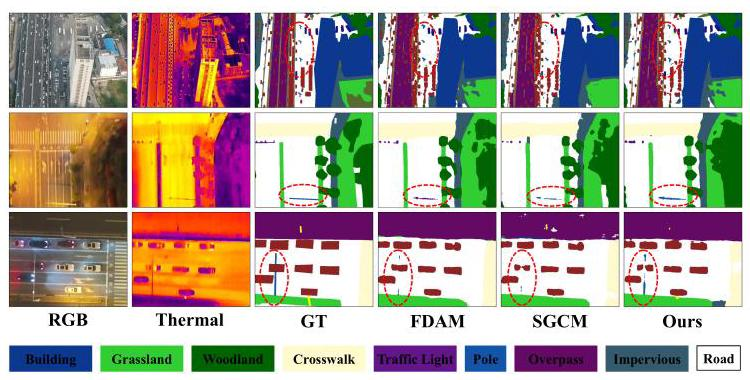

Fig. 12. Qualitative ablation on the URTF benchmark. From left to right: RGB image, thermal image, ground truth, FDAM-only, SGCM-only, and full GSCNet.

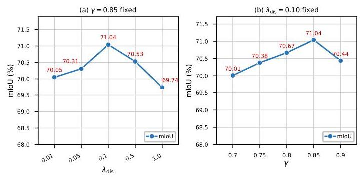

Fig. 13. Sensitivity analysis of key hyperparameters on the URTF validation set. Red labels show mIoU (%) at each setting. (a) Varying decoupling weight ${\lambda }_{\text{ dis }}$ with graph fusion weight $\gamma  = {0.85}$ fixed. (b) Varying graph fusion weight $\gamma$ with ${\lambda }_{\text{ dis }} = {0.10}$ fixed.

## VI. CONCLUSION

This paper introduces URTF and GSCNet for unaligned UAV RGBT image semantic segmentation. URTF contains over 25,000 RGB-T image pairs with 61 fine-grained categories and realistic cross-modal misalignment, without pixel-level registration. GSCNet combines FDAM, which aligns modality-shared structural features through illumination-aware bidirectional deformable warping, with SGCM, which calibrates category predictions through taxonomy and co-occurrence priors via graph-attention reasoning. On URTF, GSCNet reaches 71.04% mIoU and 60.17% Tail-16 IoU.

GSCNet uses 160.66M parameters and runs at 16.62 FPS, which limits real-time UAV deployment. Future work will explore lighter variants through knowledge distillation and efficient backbones, as well as cross-resolution RGB-T segmentation where the two modalities have different native resolutions.

## REFERENCES

[1] J. Wang, Z. Zheng, A. Ma, X. Lu, and Y. Zhong, "LoveDA: A remote sensing land-cover dataset for domain adaptive semantic segmentation," in Proc. Adv. Neural Inf. Process. Syst. (NeurIPS), 2021.

[2] Y. Lyu, G. Vosselman, G.-S. Xia, A. Yilmaz, and M. Y. Yang, "UAVid: A semantic segmentation dataset for UAV imagery," ISPRS J. Photogramm. Remote Sens., vol. 165, pp. 108-119, 2020.

[3] C. Sakaridis, D. Dai, and L. Van Gool, "Semantic foggy scene understanding with synthetic data," Int. J. Comput. Vis., vol. 126, no. 9, pp. 973-992, 2018.

[4] J. Vertens, J. Zürn, and W. Burgard, "HeatNet: Bridging the day-night domain gap in semantic segmentation with thermal images," in Proc. IEEE/RSJ Int. Conf. Intell. Robots Syst. (IROS), 2020, pp. 8461-8468.

[5] Q. Ha, K. Watanabe, T. Karasawa, Y. Ushiku, and T. Harada, "MFNet: Towards real-time semantic segmentation for autonomous vehicles with multi-spectral scenes," in Proc. IEEE/RSJ Int. Conf. Intell. Robots Syst. (IROS), 2017, pp. 5108-5115.

[6] S. S. Shivakumar, N. Rodrigues, A. Zhou, I. D. Miller, V. Kumar, and C. J. Taylor, "PST900: RGB-thermal calibration, dataset and segmentation network," in Proc. IEEE Int. Conf. Robot. Autom. (ICRA), 2020, pp. 9441-9447.

[7] J. Zhang, H. Liu, K. Yang, X. Hu, R. Liu, and R. Stiefelhagen, "CMX: Cross-modal fusion for RGB-X semantic segmentation with transformers," IEEE Trans. Intell. Transp. Syst., vol. 24, no. 12, pp. 14679-14694, 2023.

[8] C. Chen, J. Qi, X. Liu, K. Bin, R. Fu, X. Hu, and P. Zhong, "Weakly misalignment-free adaptive feature alignment for UAVs-based multimodal object detection," in Proc. IEEE/CVF Conf. Comput. Vis. Pattern Recognit. (CVPR), 2024, pp. 26836-26845.

[9] J. Liu, Z. Liu, G. Wu, L. Ma, R. Liu, W. Zhong, Z. Luo, and X. Fan, "Multi-interactive feature learning and a full-time multi-modality benchmark for image fusion and segmentation," in Proc. IEEE/CVF Int. Conf. Comput. Vis. (ICCV), 2023, pp. 8115-8124.

[10] H. Zhang, X. Zuo, J. Jiang, C. Guo, and J. Ma, "MRFS: Mutually reinforcing image fusion and segmentation," in Proc. IEEE/CVF Conf. Comput. Vis. Pattern Recognit. (CVPR), 2024, pp. 26974-26983.

[11] C. Chen et al., "CART: Cross-modal alignment for RGB-thermal semantic segmentation in UAV scenarios," in Proc. IEEE Int. Conf. Multimedia Expo (ICME), 2024.

[12] W. Ji, J. Li, W. Li, Y. Shen, H. Jin et al., "Unleashing multispectral video's potential in semantic segmentation: A semi-supervised viewpoint and new UAV-view benchmark," Adv. Neural Inf. Process. Syst., vol. 37, pp. 65717-65737, 2024.

[13] J. Ouyang, Q. Wang, Y. Shang, P. Jin, H. Zhong, L. Zhou, and T. Shen, "An RGB-TIR dataset from UAV platform for robust urban traffic scenes semantic segmentation," Sci. Data, 2025.

[14] C. Hazirbas, L. Ma, C. Domokos, and D. Cremers, "FuseNet: Incorporating depth into semantic segmentation via fusion-based CNN architecture," in Proc. Asian Conf. Comput. Vis. (ACCV), 2016, pp. 213- 228.

[15] Y. Sun, W. Zuo, and M. Liu, "RTFNet: RGB-thermal fusion network for semantic segmentation of urban scenes," IEEE Robot. Autom. Lett., vol. 4, no. 3, pp. 2576-2583, 2019.

[16] F. Deng, H. Feng, M. Liang, H. Wang, Y. Yang, Y. Gao, J. Chen, J. Hu, X. Guo, and T. L. Lam, "FEANet: Feature-enhanced attention network for RGB-thermal real-time semantic segmentation," in Proc. IEEE/RSJ Int. Conf. Intell. Robots Syst. (IROS), 2021, pp. 4467-4473.

[17] W. Zhou, S. Dong, C. Xu, and Y. Qian, "Edge-aware guidance fusion network for RGB-thermal scene parsing," in Proc. AAAI Conf. Artif. Intell., vol. 36, no. 3, 2022, pp. 3571-3579.

[18] W. Zhou, J. Liu, J. Lei, L. Yu, and J.-N. Hwang, "GMNet: Graded-feature multilabel-learning network for RGB-thermal urban scene semantic segmentation," IEEE Trans. Image Process., vol. 30, pp. 7790- 7802, 2021.

[19] J. Long, E. Shelhamer, and T. Darrell, "Fully convolutional networks for semantic segmentation," in Proc. IEEE/CVF Conf. Comput. Vis. Pattern Recognit. (CVPR), 2015, pp. 3431-3440.

[20] L.-C. Chen, G. Papandreou, I. Kokkinos, K. Murphy, and A. L. Yuille, "DeepLab: Semantic image segmentation with deep convolutional nets, atrous convolution, and fully connected CRFs," IEEE Trans. Pattern Anal. Mach. Intell., vol. 40, no. 4, pp. 834-848, 2017.

[21] F. Yu and V. Koltun, "Multi-scale context aggregation by dilated convolutions," arXiv preprint arXiv:1511.07122, 2015.

[22] L.-C. Chen, Y. Zhu, G. Papandreou, F. Schroff, and H. Adam, "Encoder-decoder with atrous separable convolution for semantic image segmentation," in Proc. Eur. Conf. Comput. Vis. (ECCV), 2018, pp. 801-818.

[23] Y. Chen, M. Rohrbach, Z. Yan, S. Yan, J. Feng, and Y. Kalantidis, "Graph-based global reasoning networks," in Proc. IEEE/CVF Conf. Comput. Vis. Pattern Recognit. (CVPR), 2019.

[24] L. Zhang, D. Xu, A. Arnab, and P. H. Torr, "Dynamic graph message passing networks," in Proc. IEEE/CVF Conf. Comput. Vis. Pattern Recognit. (CVPR), 2020.

[25] B. Gui, L. Sam, A. Bhardwaj, D. S. Gómez, F. G. Peñaloza, M. F. Buchroithner, and D. R. Green, "SAGRNet: A novel object-based graph convolutional neural network for diverse vegetation cover classification in remotely-sensed imagery," ISPRS J. Photogramm. Remote Sens., vol. 227, pp. 99-124, 2025.

[26] L. Bertinetto, R. Mueller, K. Tertikas, S. Samangooei, and N. A. Lord, "Making better mistakes: Leveraging class hierarchies with deep networks," in Proc. IEEE/CVF Conf. Comput. Vis. Pattern Recognit. (CVPR), 2020.

[27] Z.-M. Chen, X.-S. Wei, P. Wang, and Y. Guo, "Multi-label image recognition with graph convolutional networks," in Proc. IEEE/CVF Conf. Comput. Vis. Pattern Recognit. (CVPR), 2019, pp. 5177-5186.

[28] D. DeTone, T. Malisiewicz, and A. Rabinovich, "Deep image homography estimation," arXiv preprint arXiv:1606.03798, 2016.

[29] M. Jaderberg, K. Simonyan, A. Zisserman et al., "Spatial transformer networks," Adv. Neural Inf. Process. Syst., vol. 28, 2015.

[30] A. Dosovitskiy, P. Fischer, E. Ilg, P. Hausser, C. Hazirbas, V. Golkov, P. Van Der Smagt, D. Cremers, and T. Brox, "Flownet: Learning optical flow with convolutional networks," in Proc. IEEE Int. Conf. Comput. Vis. (ICCV), 2015, pp. 2758-2766.

[31] D. Sun, X. Yang, M.-Y. Liu, and J. Kautz, "PWC-Net: CNNs for optical flow using pyramid, warping, and cost volume," in Proc. IEEE/CVF Conf. Comput. Vis. Pattern Recognit. (CVPR), 2018, pp. 8934-8943.

[32] X. Zhu, H. Hu, S. Lin, and J. Dai, "Deformable convnets v2: More deformable, better results," in Proc. IEEE/CVF Conf. Comput. Vis. Pattern Recognit. (CVPR), 2019, pp. 9308-9316.

[33] W. Lai, F. Zeng, X. Hu, S. He, Z. Liu, and Y. Jiang, "RegSeg: An end-to-end network for multimodal RGB-thermal registration and semantic segmentation," IEEE Trans. Image Process., vol. 33, pp. 6676-6690, 2024.

[34] H. Zhou, Z. Zhang, C. Li, C. Tian, Y. Xie, Z. Li, and X.-J. Wu, "Deformation-resilient multigranularity learning for unaligned RGB-T semantic segmentation," IEEE Trans. Neural Netw. Learn. Syst., vol. 36, no. 10, pp. 18530-18544, 2025.

[35] D. Hazarika, R. Zimmermann, and S. Poria, "MISA: Modality-invariant and-specific representations for multimodal sentiment analysis," in Proc. 28th ACM Int. Conf. Multimedia, 2020, pp. 1122-1131.

[36] X. Xu, K. Lin, L. Gao, H. Lu, H. T. Shen, and X. Li, "Learning cross-modal common representations by private-shared subspaces separation," IEEE Trans. Cybern., vol. 52, no. 5, pp. 3261-3275, 2020.

[37] E. Xie, W. Wang, Z. Yu, A. Anandkumar, J. M. Alvarez, and P. Luo, "SegFormer: Simple and efficient design for semantic segmentation with transformers," Adv. Neural Inf. Process. Syst., vol. 34, pp. 12077-12090, 2021.

[38] G. Wang, T. Zhang, J. Cheng, S. Liu, Y. Yang, and Z. Hou, "Rgb-infrared cross-modality person re-identification via joint pixel and feature alignment," in Proc. IEEE/CVF Int. Conf. Comput. Vis. (ICCV), 2019, pp. 3623-3632.

[39] H. Chen, Y. Deng, Y. Li, T.-Y. Hung, and G. Lin, "RGBD salient object detection via disentangled cross-modal fusion," IEEE Trans. Image Process., vol. 29, pp. 8407-8416, 2020.

[40] P. Veličković, G. Cucurull, A. Casanova, A. Romero, P. Liò, and Y. Bengio, "Graph attention networks," in Proc. Int. Conf. Learn. Represent. (ICLR), 2018.

[41] M. Rahnemoonfar, T. Chowdhury, A. Sarkar, D. Varshney, M. Yari, and R. R. Murphy, "FloodNet: A high resolution aerial imagery dataset for post flood scene understanding," IEEE Access, vol. 9, pp. 89644-89654, 2021.

[42] W. Cai, K. Jin, J. Hou, C. Guo, L. Wu, and W. Yang, "VDD: Varied drone dataset for semantic segmentation," J. Vis. Commun. Image Represent., 2025.

[43] W. Ji, J. Li, C. Bian, Z. Zhang, and L. Cheng, "SemanticRT: A large-scale dataset and method for robust semantic segmentation in multispectral images," in Proc. 31st ACM Int. Conf. Multimedia, 2023, pp. 3307-3316.

[44] K. Sun, B. Xiao, D. Liu, and J. Wang, "Deep high-resolution representation learning for human pose estimation," in Proc. IEEE/CVF Conf. Comput. Vis. Pattern Recognit. (CVPR), 2019, pp. 5693-5703.

[45] B. Cheng, I. Misra, A. G. Schwing, A. Kirillov, and R. Girdhar, "Masked-attention mask transformer for universal image segmentation," in Proc. IEEE/CVF Conf. Comput. Vis. Pattern Recognit. (CVPR), 2022.

[46] M.-H. Guo, C.-Z. Lu, Q. Hou, Z. Liu, M.-M. Cheng, and S.-M. Hu, "SegNeXt: Rethinking convolutional attention design for semantic segmentation," in Proc. Adv. Neural Inf. Process. Syst. (NeurIPS), 2022.

[47] Z. Chen, T. Xu, Y. Pan, N. Shen, H. Chen, and J. Li, "Edge feature enhancement for fine-grained segmentation of remote sensing images," IEEE Trans. Geosci. Remote Sens., vol. 62, pp. 1-13, 2024.

[48] J. Zhang, R. Liu, H. Shi, K. Yang, S. Reiß, K. Peng, H. Fu, K. Wang, and R. Stiefelhagen, "Delivering arbitrary-modal semantic segmentation," in Proc. IEEE/CVF Conf. Comput. Vis. Pattern Recognit. (CVPR), 2023.

[49] Y. Wang, G. Li, and Z. Liu, "SGFNet: Semantic-guided fusion network for RGB-thermal semantic segmentation," IEEE Trans. Circuits Syst. Video Technol., vol. 33, no. 12, pp. 7737-7748, 2023.

[50] U. Shin, K. Lee, and I.-S. Kweon, "Complementary random masking for RGB-thermal semantic segmentation," in Proc. IEEE Int. Conf. Robot. Autom. (ICRA), 2024, pp. 11110-11117.

[51] D. Jia, J. Guo, K. Han, H. Wu, C. Zhang, C. Xu, and X. Chen, "Gemini-Fusion: Efficient pixel-wise multimodal fusion for vision transformer," in Proc. Int. Conf. Mach. Learn. (ICML), 2024.

[52] P. Zhang, B. Peng, C. Lu, Q. Huang, and D. Liu, "ASANet: Asymmetric semantic aligning network for RGB and SAR image land cover classification," ISPRS J. Photogramm. Remote Sens., vol. 218, pp. 574-587, 2024.

[53] J. Liu, H. Liu, X. Li, J. Ren, and X. Xu, "MiLNet: Multiplex interactive learning network for RGB-T semantic segmentation," IEEE Trans. Image Process., vol. 34, pp. 1686-1699, 2025.

[54] B.-W. Yin, J.-L. Cao, M.-M. Cheng, and Q. Hou, "DFormerV2: Geometry self-attention for RGBD semantic segmentation," in Proc. IEEE/CVF Conf. Comput. Vis. Pattern Recognit. (CVPR), 2025, pp. 19 345-19 355.

[55] H. Zhong, F. Tang, Z. Chen, H. J. Chang, and Y. Gao, "AMDANet: Attention-driven multi-perspective discrepancy alignment for RGB-infrared image fusion and segmentation," in Proc. IEEE/CVF Int. Conf. Comput. Vis. (ICCV), October 2025, pp. 10 645-10 655.

[56] R. Ni, Y. Guo, B. Yang, Y. Liu, H. Wang, and C. Hu, "Mul-VMamba: Multimodal semantic segmentation using selection-fusion-based vision-Mamba," Knowl.-Based Syst., vol. 334, p. 115119, 2026.

[57] F. Gu, Y. Li, X. Long, K. Ji, C. Chen, Q. Gu, and Z. Ni, "MambaSeg: Harnessing Mamba for accurate and efficient image-event semantic segmentation," in Proc. AAAI Conf. Artif. Intell., 2026.