6
2026
2
0
2
r p A 9 2 ] V C . s c [ 1 v 3 9 8 6 2 . 4 0 6
2
:
v
arX1V
i
X
r
a
FAN ET AL.: UNALIGNED UAV RGBT IMAGE SEMANTIC SEGMENTATION

# Graph-based Semantic Calibration Network for Unaligned UAV RGBT Image Semantic Segmentation and A Large-scale Benchmark

Fangqiang Fan, Zhicheng Zhao*, Xiaoliang Ma, Chenglong Li, and Jin Tang
Abstract—Fine-grained RGBT image semantic segmentation is
crucial for all-weather unmanned aerial vehicle (UAV) scene un- derstanding. However, UAV RGBT semantic segmentation faces two coupled challenges: cross-modal spatial misalignment caused by sensor parallax and platform vibration, and severe semantic confusion among fine-grained ground objects under top-down aerial views. To address these issues, we propose a Graph-based Semantic Calibration Network (GSCNet) for unaligned UAV RGBT image semantic segmentation. Specifically, we design a Feature Decoupling and Alignment Module (FDAM) that decou- ples each modality into shared structural and private perceptual components and performs deformable alignment in the shared subspace, enabling robust spatial correction with reduced modal- ity appearance interference. Moreover, we propose a Semantic Graph Calibration Module (SGCM) that explicitly encodes the hierarchical taxonomy and co-occurrence regularities among ground-object categories in UAV scenes into a structured cat- egory graph, and incorporates these priors into graph-attention reasoning to calibrate predictions of visually similar and rare categories. In addition, we construct the Unaligned RGB-Thermal Fine-grained (URTF) benchmark, to the best of our knowledge, the largest and most fine-grained benchmark for unaligned UAV RGBT image semantic segmentation, containing over 25,000 image pairs across 61 categories with realistic cross-modal misalignment. Extensive experiments on URTF demonstrate that GSCNet significantly outperforms state-of-the-art methods, with notable gains on fine-grained categories. The dataset is available at https://github.com/mmic-lcl/Datasets-and-benchmark-code.
Index Terms—RGBT semantic segmentation, fine-grained se- mantic segmentation, feature decoupling, semantic graph cali- bration, unmanned aerial vehicle.
I. INTRODUCTION
UNMANNED aerial vehicles (UAVs) are widely used for all-weather scene understanding in applications such as urban planning, precision agriculture, and traffic monitor- ing [1], [2]. Semantic segmentation is a core capability in these applications. RGB images provide rich texture cues but degrade under low illumination and adverse weather, whereas
* Corresponding author: Zhicheng Zhao.
This work was supported in part by the National Natural Science Foundation of China (No. 62306005, 62006002, 62076003, 62376005 and 62576006), and in part by the Natural Science Foundation of Anhui Higher Education Institution (No. 2022AH040014).
F. Fan, Z. Zhao, and C. Li are with Key Laboratory of Intelligent Comput- ing & Signal Processing (Anhui University), Ministry of Education, Anhui Provincial Key Laboratory of Multimodal Cognitive Computation, School of Artificial Intelligence, Anhui University, Hefei 230601, China. (Email: fanadmin@163.com, zhaozhicheng@ahu.edu.cn, lcl1314@foxmail.com).
X. Ma is with the School of Computer Science and Technology, Anhui University, Hefei 230601, China, and also with GEOVIS Earth Technology Co., Ltd., Hefei 230088, China.
J. Tang is with the Anhui Provincial Key Laboratory of Multimodal Cognitive Computation, School of Computer Science and Technology, Anhui University, Hefei 230601, China. (Email: tangjin@ahu.edu.cn).
thermal infrared images remain informative under these con- ditions but provide coarser structural details due to their lower spatial resolution [3], [4]. Given these complementary strengths, fusing the two modalities is a natural choice for ro- bust UAV scene understanding [5], [6]. However, on real dual- sensor UAV platforms, RGB and thermal images are rarely pixel-aligned because sensor parallax, platform vibration, and view-dependent distortions introduce spatially varying offsets. Unaligned UAV RGBT image semantic segmentation aims to predict fine-grained semantic masks from spatially misaligned RGB-T image pairs under realistic UAV sensing conditions.
Cross-modal spatial misalignment is difficult to handle in this setting because the offsets are spatially varying and often object-dependent, so no single global transformation can remove them. As Fig. 1 shows, such boundary discrepancies occur across diverse object categories in UAV scenes. When methods such as CMX [7] fuse these misaligned features under an implicit alignment assumption, they mix responses from semantically inconsistent locations, producing ghosting artifacts, blurred boundaries, and missed small targets [8].
Beyond spatial misalignment, severe semantic confusion among fine-grained ground objects poses another major chal- lenge. Under top-down aerial views, many categories share similar visual appearance. Poles, streetlights, and traffic lights, for instance, occupy few pixels and look alike in both RGB and thermal images. The pixel distribution is also long-tailed, leaving rare classes with too few samples to learn stable boundaries. Most existing methods classify pixels in a flat label space and ignore hierarchical or co-occurrence relations among related categories. As Fig. 2 shows, these factors make categories such as pole, streetlight, and traffic light hard to tell apart, with tail classes suffering most from limited training pixels.
These two problems interact: misalignment corrupts the vi- sual evidence that fine-grained recognition depends on, which in turn amplifies confusion among categories that already look alike. We propose GSCNet, a Graph-based Semantic Cali- bration Network that chains spatial alignment with semantic calibration. Estimating offsets directly in the raw feature space is unreliable because RGB and thermal features differ in ap- pearance and contrast. Our Feature Decoupling and Alignment Module (FDAM) therefore first decouples each modality into shared structural and private perceptual components and then estimates deformable offsets in the shared subspace where the modality gap is reduced, deriving geometric corrections from structurally consistent representations without discarding modality-specific cues. Pixel-level classification alone cannot separate categories that overlap in local appearance, nor can it learn rare ones well without inter-class structure. Our Semantic
1
FAN ET AL.: UNALIGNED UAV RGBT IMAGE SEMANTIC SEGMENTATION

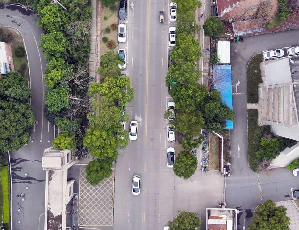

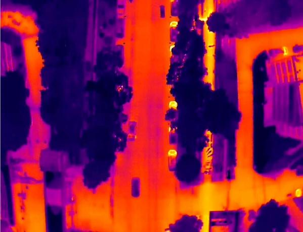

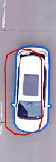

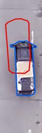

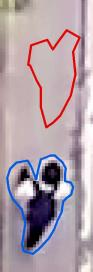

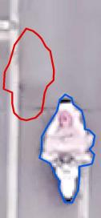

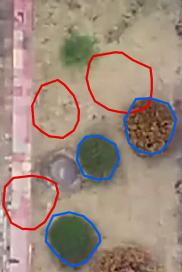

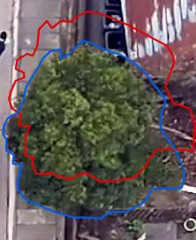

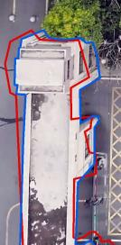

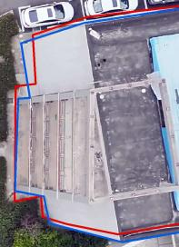

Vehicle
Person
Vegetation
Building

*Fig. 1. Cross-modal boundary misalignment in RGB-T UAV imaging. The top row shows an RGB image and its thermal counterpart. In the bottom row, blue contours denote object boundaries in the RGB modality and red contours denote the corresponding boundaries in the thermal modality. Representative examples from vehicles, persons, vegetation, and buildings show that cross- modal spatial offsets are widespread in UAV scenes.*

Graph Calibration Module (SGCM) encodes hierarchical tax- onomy and co-occurrence regularities among ground-object categories into a structured category graph and uses graph- attention reasoning so that visually similar and rare categories can borrow discriminative context from semantically related nodes.
We also construct a large-scale benchmark named URTF (Unaligned RGB-Thermal Fine-grained). Ground-level RGB- T datasets such as MFNet [5], PST900 [6], FMB [9], and MVSeg [10] assume strict pixel-wise registration and provide only coarse category definitions, while UAV-specific datasets such as CART [11], MVUAV [12], and Kust4K [13] still offer limited category granularity or rely on pixel-level alignment. URTF is, to the best of our knowledge, the largest and most fine-grained benchmark for this setting, containing over 25,000 image pairs with 61 semantic categories and realistic cross- modal misalignment under diverse illumination and weather conditions.
The primary contributions of this work are summarized as follows:
- • We construct URTF, to the best of our knowledge the largest and most fine-grained benchmark for unaligned UAV RGBT image semantic segmentation, containing over 25,000 image pairs across 61 semantic categories with realistic cross-modal misalignment under diverse illumination and weather conditions.
- • We propose GSCNet, a unified spatial-semantic frame- work for robust fine-grained unaligned UAV RGBT image semantic segmentation, which jointly addresses cross- modal spatial misalignment and fine-grained semantic confusion.
- • We propose the Feature Decoupling and Alignment Module (FDAM), which decouples RGB-T features into shared structural and private perceptual components for illumination-aware deformable alignment. In addition, we introduce the Semantic Graph Calibration Mod- ule (SGCM), which explicitly encodes hierarchical taxon-

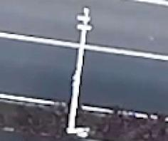

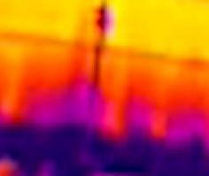

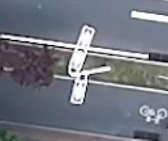

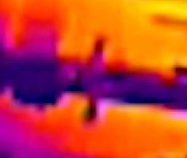

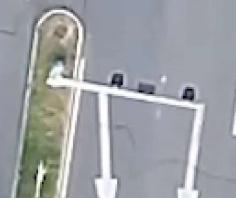

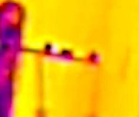

Traffic Light Streetlight
Pole

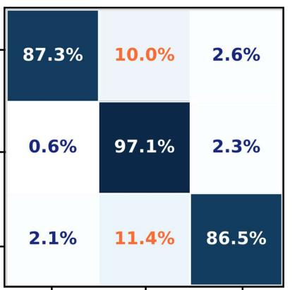

Pole
ao
Traffic Light
Traffic Light Streetlight
(b)
Pole

*Fig. 2. Fine-grained semantic confusion in UAV aerial scenes. (a) Pole, streetlight, and traffic light occupy only a small number of pixels in both RGB and thermal images and exhibit highly similar appearance from the UAV viewpoint, making them difficult to distinguish. (b) Confusion matrix of these three categories produced by AMDANet, where traffic light and pole are frequently misclassified as streetlight.*

omy and co-occurrence regularities into a structured cate- gory graph and calibrates predictions via graph-attention reasoning.
- • Extensive quantitative and qualitative experiments on URTF demonstrate that GSCNet significantly outper- forms existing state-of-the-art RGBT semantic segmen- tation methods, with notable gains on fine-grained cate- gories under challenging UAV sensing conditions.

# II. RELATED WORK

- A. RGBT Semantic Segmentation
Early multimodal segmentation methods adopt dual-stream CNNs with element-wise fusion. FuseNet [14], originally designed for RGB-D, establishes the element-wise summa- tion paradigm later widely adopted in RGBT segmentation. MFNet [5] introduces a lightweight mini-inception encoder for real-time RGBT parsing, and RTFNet [15] progressively folds thermal features into the RGB decoder. These encoder- fusion designs establish the basic dual-stream paradigm but rely on hand-crafted aggregation rules that cannot selectively weight informative regions. Subsequent work introduces at- tention mechanisms to modulate cross-modal contributions. FEANet [16] applies a feature-enhanced attention module to exploit fine spatial details, EGFNet [17] adds edge-guided attention for boundary refinement, and GMNet [18] explores channel-level and spatial-level gating to suppress noisy modal- ity responses. More recently, Transformer-based architectures further extend the fusion receptive field: CMX [7] performs cross-attention between RGB and auxiliary tokens, achieving state-of-the-art results on multiple benchmarks. Alongside architectural progress, benchmarks have expanded from the 9- class MFNet dataset [5] to 36-category UAV benchmarks [12], and UAV-specific datasets such as CART [11] and Kust4K [13] have also emerged. Despite this progress, existing RGBT segmentation methods generally assume ideal pixel-level reg- istration, and no RGB-T benchmark simultaneously provides fine-grained annotation granularity, large-scale coverage, and realistic cross-modal misalignment.

# B. Fine-Grained Semantic Segmentation

Semantic segmentation has advanced from FCN-based en- coders [19], [20] toward fine-grained recognition, yet global
2
FAN ET AL.: UNALIGNED UAV RGBT IMAGE SEMANTIC SEGMENTATION
context mechanisms such as dilated convolutions [21] and ASPP [22] alone cannot resolve inter-class confusion where category boundaries correlate with semantic attributes rather than visual gradients. Fine-grained segmentation faces two coupled difficulties: inter-class confusion among visually sim- ilar subcategories and long-tailed recognition where rare categories are under-optimized. Graph-based reasoning has been introduced to capture inter-class relations beyond local receptive fields. GloRe [23] projects pixel features onto a set of latent nodes and performs relational reasoning in the graph domain, while DGMN [24] dynamically generates graph structures conditioned on each input image. In remote sensing, SAGRNet [25] builds object-level graphs with co-occurrence statistics to improve vegetation classification. Other methods inject external priors such as hierarchical taxonomy [26] or label co-occurrence [27] into the graph topology. However, purely data-driven graphs lack interpretable structure, whereas static prior graphs cannot adapt to scene-specific category distributions. Our SGCM combines both: it initializes the adjacency from hierarchical and co-occurrence priors and augments it with a learnable residual that adapts to data-driven patterns during training.

# C. Unaligned Multimodal Fusion

Estimating spatial correspondence between heterogeneous sensor modalities is a prerequisite for coherent feature fusion. Classical global transforms [28] cannot capture local, depth- dependent parallax on UAV platforms, while dense per-pixel methods (STN [29], optical flow [30], [31]) suffer from the modality-gap dilemma in which appearance discrepancy is conflated with genuine offsets; deformable convolution [32] handles intra-modal irregularities but does not address un- reliable cross-modal offset estimation. Recent work couples alignment with downstream tasks. OAFA [8] projects RGB- T features into a common subspace for deformable offset estimation, and RegSeg [33] jointly optimizes registration and segmentation through a shared encoder. These meth- ods improve alignment but neither separates modality-shared structure from modality-specific appearance, leaving align- ment exposed to residual cross-modal interference. Zhou et al. [34] construct synthetically deformed pairs from the 9- class MFNet dataset, but the deformations are artificial and the label space remains limited. Shared-private decomposition methods [35], [36] reduce inter-modal discrepancy but do not recover spatial correspondence. Our FDAM bridges these two lines: it performs explicit shared-private decomposition with contrastive and orthogonality constraints, estimates deformable offsets in the modality-shared structural subspace, and intro- duces illumination-adaptive anchor selection to handle day-
night variation.
III. METHOD
- A. Overall Architecture
Fig. 3 shows the overall architecture. GSCNet builds on SegFormer [37] with two modality-specific Mix Transformer (MiT) branches that generate four-stage feature hierarchies (Ci ∈ {64,128,320,512}). The two branches share the same
architecture but use independent parameters to accommodate appearance differences between modalities. At each stage, FDAM decouples the features into shared structural and private perceptual components and aligns them in the shared subspace. The SegFormer all-MLP decoder then aggregates the aligned multi-scale features to produce the fused representation Ffuse and the base logits L0. FDAM handles cross-modal spatial misalignment at the feature level; SGCM then calibrates L0 through graph-attention reasoning over a structured category graph encoding hierarchical and co-occurrence regularities. Sections III-B and III-C describe each module in detail.
B. Feature Decoupling and Alignment Module (FDAM)
Applying deformable convolutions [32] directly to raw multimodal features is unreliable: the offset predictor confuses genuine spatial displacements with the inherent appearance gap between RGB texture and thermal radiation. FDAM addresses this with a decouple-then-align strategy based on the observation that object geometry is more stable across modalities than appearance cues [36], [38]. It first separates each modality into a shared structural branch and a private perceptual branch via AFD, estimates deformable offsets in the shared subspace via IAA, and reuses the same geometric cor- rections for the private branches under illumination-adaptive anchor selection.
1) Asymmetric Feature Decoupling (AFD): As shown in Fig. 4(a), AFD decomposes each stage into one shared en- coder and two private encoders. The shared encoder ϕs is a lightweight two-layer Conv-BN-ReLU block whose weights are shared across the RGB and thermal streams, encouraging both modalities to meet in a common structural subspace. In contrast, each private encoder is a shallower modality- specific single-layer block, so it mainly retains sensory details such as RGB texture and thermal intensity patterns instead of re-encoding high-level semantics. Formally, for stage i, the decoupling process is defined as:

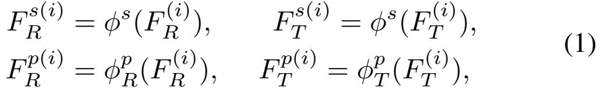

where ϕs denotes the parameter-shared encoder, and ϕp
T denote the modality-specific private encoders.
R, ϕp
Following shared-private disentanglement ideas in multi- modal representation learning [35], we train AFD with three mutually dependent losses. The primary objective is a patch- based contrastive alignment loss L(i) align that pulls correspond- ing structural patches together while separating mismatched ones:

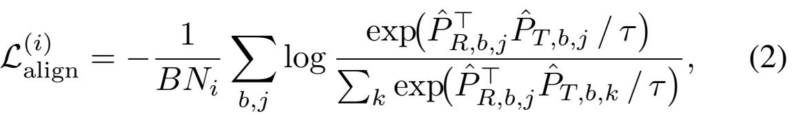

where ˆPR, ˆPT ∈ RB×Ni×Ci are ℓ2-normalized patch vectors obtained by average pooling with kernel size 8, yielding Ni = ⌊Hi/8⌋×⌊Wi/8⌋ patches per stage, and τ = 0.07. The combined downsampling of the encoder (2i+1) and the pool- ing stride subsumes residual cross-modal offsets within each patch, so Lalign enforces structural correspondence rather than
3